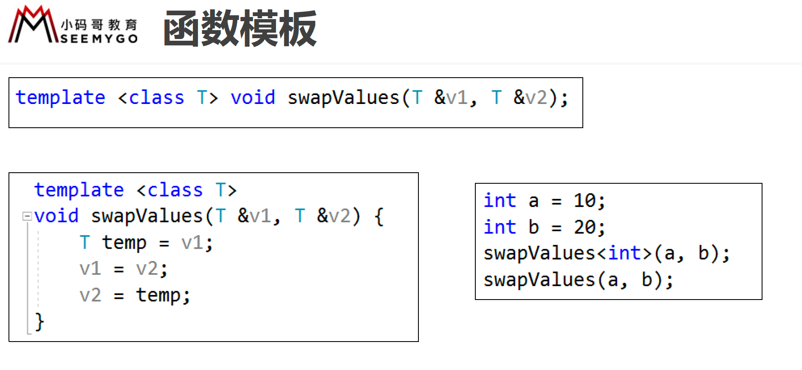
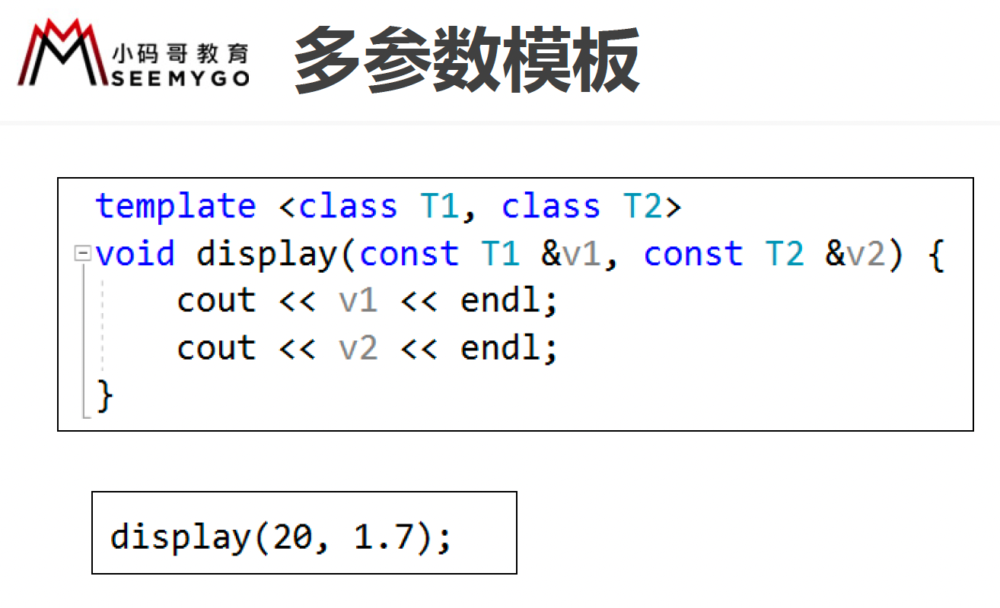

# 模板 （template）

泛型，是一种将类型参数化以达到代码复用的技术，C++中使用模板来实现泛型

- 模板的使用格式如下
	 - template<typename\classT>
	 - typename和class是等价的
- 模板没有被使用时，是不会被实例化出来的
- 模板的声明和实现如果分离到.h和.cpp中，会导致链接错误
- 一般将模板的声明和实现统一放到一个.hpp文件中

``` c++
#include <iostream>
#include "add.hpp"

using namespace std;

class Point {
	friend ostream &operator<<(ostream &, const Point &);
	int m_x;
	int m_y;
public:
	Point(int x, int y) :m_x(x), m_y(y) {}
	Point operator+(const Point &point) {
		return Point(m_x + point.m_x, m_y + point.m_y);
	}
};

ostream &operator<<(ostream &cout, const Point &point) {
	return cout << "(" << point.m_x << ", " << point.m_y << ")";
}

int main() {

	cout << add(10, 20) << endl; // call 函数地址
	cout << add(1.5, 21.6) << endl; // call 函数地址
	cout << add(Point(1, 2), Point(3, 4)) << endl;

	// 编译、链接原理

	getchar();
	return 0;
}
```


add.hpp

``` c++
#pragma once

template <typename T>
T add(T a, T b) {
	return a + b;
}
```






# 类模板

``` c++
#pragma once
#include <iostream>
using namespace std;

template <typename Item>
class Array {
	friend ostream &operator<<<>(ostream &, const Array<Item> &);
	// 用于指向首元素
	Item *m_data;
	// 元素个数
	int m_size;
	// 容量
	int m_capacity;
	void checkIndex(int index);
public:
	Array(int capacity = 0);
	~Array();
	void add(Item value);
	void remove(int index);
	void insert(int index, Item value);
	Item get(int index);
	int size();
	Item operator[](int index);
};

template <typename Item>
Array<Item>::Array(int capacity) {
	m_capacity = (capacity > 0) ? capacity : 10;

	// 申请堆空间
	m_data = new Item[m_capacity];
}

template <typename Item>
Array<Item>::~Array() {
	if (m_data == NULL) return;
	delete[] m_data;
}

template <typename Item>
void Array<Item>::checkIndex(int index) {
	if (index < 0 || index >= m_size) {
		// 报错：抛异常
		throw "数组下标越界";
	}
}

template <typename Item>
void Array<Item>::add(Item value) {
	if (m_size == m_capacity) {
		// 扩容
		/*
		1.申请一块更大的新空间
		2.将旧空间的数据拷贝到新空间
		3.释放旧空间
		*/
		cout << "空间不够" << endl;
		return;
	}

	m_data[m_size++] = value;
}

template <typename Item>
void Array<Item>::remove(int index) {
	checkIndex(index);

}

template <typename Item>
void Array<Item>::insert(int index, Item value) {
	
}

template <typename Item>
Item Array<Item>::get(int index) {
	checkIndex(index);

	return m_data[index];
}

template <typename Item>
int Array<Item>::size() {
	return m_size;
}

template <typename Item>
Item Array<Item>::operator[](int index) {
	return get(index);
}

// 友元函数里有范型，需要添加 <>
template <typename Item>
ostream &operator<<<>(ostream &cout, const Array<Item> &array) {
	cout << "[";

	for (int i = 0; i < array.m_size; i++) {
		if (i != 0) {
			cout << ", ";
		}
		cout << array.m_data[i];
	}

	return cout << "]";
}
```

