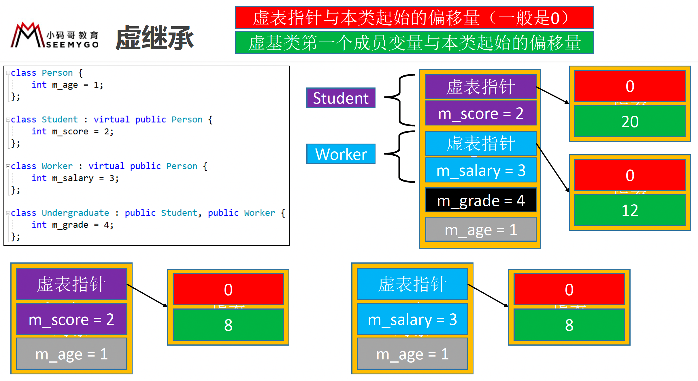

 

 

# 1. 类

C++中使用struct、class定义类

struct的默认成员权限是public，class是private 

``` c++

class Person {
    // 成员变量（属性）
    int age;
    
    // 成员函数（方法）
    void run() {
        
    }
};

struct Person {
    // 成员变量（属性）
    int age;
    
    // 成员函数（方法）
    void run() {
        
    }
};

// 创建类对象
Person person;
person.age = 10;
person.run();
```

# 2. this

this是指向当前对象的指针

隐式参数

``` c++
struct Person {
    int m_id;
    
    void display() {
        // 因为this是指针，只能通过箭头访问成员变量
        cout << this->m_id << endl;
        cout << m_id << endl;
    }
}
```


# 3. 指针访问对象成员的本质

``` c++

struct Person {
    int m_id;
    int m_age;
    int m_height;
    
    void display() {
        std::cout << m_id << m_age << m_height << std::endl;
    }
};


void test() {
    
    // 创建类对象
    Person person;
    person.m_id = 10;
    person.m_age = 20;
    person.m_height = 30;
    
    Person *p = (Person *)&person.m_age;
    p->m_id = 40;
    p->m_age = 50;
     
    person.display(); // 104050
    p->display(); // 40501876947616
    
}

```


# 4. 封装

成员变量私有化，提供公共的getter和setter给外界去访问成员变量

``` c++

struct Person {
private:
    int m_age;
public:
    void setAge(int age) {
        this->m_age = age;
    }
    int getAge() {
        return this->m_age;
    }
};
```


# 5. 内存空间的布局

- 代码段（代码区）
    - 用于存放代码
    - 函数
- 数据区（全局区）
    - 用于存放全局变量
- 栈空间
    - 每调用一个函数就会给它分配一段连续的栈空间，等函数调用完毕后会自动回收这段栈空间
    - 自动分配和回收
- 堆空间
    - 需要主动去申请和释放


# 6. 堆空间

在程序运行过程，为了能够自由控制内存的生命周期、大小，会经常使用堆空间的内存


堆空间的申请\释放

- malloc \ free
- new \ delete
- new[] \ delete[]


注意

- 申请堆空间成功后，会返回那一段内存空间的地址
- 申请和释放必须是1对1的关系，不然可能会存在内存泄露


``` c++
// 申请4个字节的堆空间
int *p = (int *) malloc(4);
*p = 10; // 向p指针指向的4个字节的堆空间存放数据

free(p); // 堆空间需要手动释放
```


``` c++
char *p = (char *) malloc(4);
*p = 10; // 向p指向的堆空间的第一个字节存放数据
*(p + 1) = 11; // 向p指向的下一个字节存放数据
*(p + 2) = 12;
*(p + 3) = 13;

p[0] = 10;
p[1] = 11;
p[2] = 12;
p[3] = 13;

free(p); // 会把4个字节都释放
```


``` c++
int *p = new int;
*p = 10;

delete p;
```


``` c++
char *p = new char[4];

delete[] p;
```


## 6.1 memset

``` c++
int size = sizeof(int) * 8;
int *p = (int *) malloc(size);
// memory set
memset(p, 1, 4); // 将4个字节中的每一个字节都设置为1
```


``` c++
int *p0 = new int; // 不会进行初始化
int *p1 = new int(); // 初始化为0
int *p2 = new int(5); // 初始化为5
int *p3 = new int[3]; // 不会初始化
int *p4 = new int[3](); // 初始化为0
int *p5 = new int[3]{}; // 初始化为0
int *p6 = new int[3]{ 5 }; // 首元素初始化为5，其他元素初始化为0
```


``` c++

struct Person {
    int m_id;
    int m_age;
    int m_height;
};

Person person;
memset(&person, 0, sizeof(person)); // 将结构体变量person的内存空间清零
```


# 7. 对象的内存

``` c++
// 全局区
Person g_person;

int main() {
    // 栈空间
    Person person;
    
    // 堆空间
    Person *p = new Person;
    return 0;
}
```


# 8. 构造函数（Constructor）

一旦定义了构造函数，必须用其中一个自定义的构造函数来初始化对象


``` c++
struct Person {
    int m_age;
    
    Person() {
        m_age = 0;
    }
    
    // 可以重载，可以有多个构造函数
    Person(int age) {
        m_age = age;
    }
};

Person person;

Person person(10);
```


``` c++
// 通过malloc创建的对象，不会调用构造函数
Person *p = (Person *) malloc(sizeof(Person));
free(p);

// new会调用构造函数
Person *p = new Person;
delete p;
```


``` c++
Person person0; // 这是创建person对象
Person person1(); // 这是函数声明

Person person1() {
    return Person();
}
```


## 8.1 构造函数的互相调用

必须放在初始化列表中

``` c++

struct Person {
	int m_age;
	int m_height;

	/*Person() :Person(10, 20) {

	}*/

	Person() :Person(10, 20) {
		// 创建了一个临时的Person对象
		// Person(10, 20);
		/*Person person;
		person.m_age = 10;
		person.m_height = 20;*/
	}

	Person(int age, int height) {
		this->m_age = age;
		this->m_height = height;
	}
};
```


## 8.2 父类的构造函数

- 子类的构造函数默认会调用父类的无参构造函数
- 如果子类的构造函数显式地调用了父类的有参构造函数，就不会再去默认调用父类的无参构造函数
- 如果父类缺少无参构造函数，子类的构造函数必须显式调用父类的有参构造函数

``` c++
class Person {
	int m_age;
public:
	Person(int age) :m_age(age) {}
};

class Student : Person {
	int m_no;
public:
	Student(int age, int no) :m_no(no), Person(age) {}
};
```


# 9. 默认情况下，成员变量的初始化

如果自定义了构造函数，除了全局区，其他内存空间的成员变量默认都不会被初始化，需要开发人员手动初始化

``` c++

struct Person {
	int m_age;

	Person() {
		memset(this, 0, sizeof(Person));
	}
};

// 全局区：成员变量初始化为0
Person g_person;

void test() {
	// 栈空间：没有初始化成员变量
	// Person person; 

	// 堆空间：没有初始化成员变量
	Person *p0 = new Person;
	// 堆空间：成员变量初始化为0
	Person *p1 = new Person(); // 如果自定义了构造函数，new就不会把对象初始化为0
	Person *p2 = new Person[3]; // 成员变量不会被初始化
	Person *p3 = new Person[3](); // 3个Person对象的成员变量都初始化为0
	Person *p4 = new Person[3]{}; // 3个Person对象的成员变量都初始化为0
}
```


# 10. 析构函数（Destructor）

- 析构函数（也叫析构器），在对象销毁的时候自动调用，一般用于完成对象的清理工作
- 特点
    - 函数名以~开头，与类同名，无返回值（void都不能写），无参，不可以重载，有且只有一个析构函数
- 注意
    - 通过malloc分配的对象free的时候不会调用析构函数
- 构造函数、析构函数要声明为public，才能被外界正常使用

``` c++
class Person {
	int m_age;
public:
	// 新的Person对象诞生的象征
	Person() {
		cout << "Person::Person()" << endl;
	}

	// 一个Person对象销毁的象征
	~Person() {
		cout << "~Person()" << endl;
	}
};
```


对象内部申请的堆空间，由对象内部回收

``` c++

struct Car {
	int m_price;
};

struct Person {
private:
	Car *m_car;
public:
	Person() {
		m_car = new Car();
	}
    
	~Person() {
		delete m_car;
	}
};

int main() {

	// 内存泄露：该释放的内存并没有得到释放
	/*{
		Person person;
	}*/
}
```


# 11. 声明和实现分离

Person.h

``` c++
#pragma once

class Person {
private:
	int m_age;
public:
	void setAge(int age);
	int getAge();
	Person();
	~Person();
};

```

Person.cpp

``` c++
#include "Person.h"

void Person::setAge(int age) {
	m_age = age;
}

int Person::getAge() {
	return m_age;
}

Person::Person() {
	m_age = 0;
}

Person::~Person() {

}
```


# 12. 继承

C++中的继承，相当于直接把父类中的内容拿过来

从父类继承的成员变量会排在前面

``` c++
struct Person {

};

struct Student : Person {
	int m_no;
};
```


# 13. 成员访问权限

- 成员访问权限、继承方式有3种
    - public：公共的，任何地方都可以访问（struct默认）
    - protected：子类内部、当前类内部可以访问
    - private：私有的，只有当前类内部可以访问（class默认）
- 子类内部访问父类成员的权限，是以下2项中权限最小的那个
    - 成员本身的访问权限
    - 上一级父类的继承方式
- 开发中用的最多的继承方式是public，这样能保留父类原来的成员访问权限
- 访问权限不影响对象的内存布局


class的默认继承方式为private，struct默认继承方式为public


# 14. 初始化列表

- 一种便捷的初始化成员变量的方式
- 只能用在构造函数中
- 初始化顺序只跟成员变量的声明顺序有关
- 如果函数声明和实现是分离的
    - 初始化列表只能写在函数的实现中
    - 默认参数只能写在函数的声明中


``` c++
struct Person {
    int m_age;
    int m_height;
    
//    Person(int age, int height) {
//        m_age = age;
//        m_height = height;
//    }
    
    // 语法糖
    // 和上面的构造函数底层一样
    Person(int age, int height) :m_age(age), m_height(height) {
        
    }
};
```


# 15. 多肽

父类指针可以指向子类对象，是安全的，开发中经常用到（继承方式必须是public）

同一操作作用于不同的对象，可以有不同的解释，产生不同的执行结果

在运行时，可以识别出真正的对象类型，调用对应子类中的函数

多肽的要素：

- 子类重写父类的成员函数（override）
- 父类指针指向子类对象
- 利用父类指针调用重写的成员函数
- C++还要声明为虚函数

## 15.1 虚函数

- C++中的多态通过虚函数（virtual function）来实现
- 虚函数：被virtual修饰的成员函数
- 只要在父类中声明为虚函数，子类中重写的函数也自动变成虚函数（也就是说子类中可以省略virtual关键字）

## 15.2 虚表

虚函数的实现原理是虚表，这个虚表里面存储着最终需要调用的虚函数地址，这个虚表也叫虚函数表


## 15.3 调用父类的成员函数实现

``` c++

class Animal {
public:
    virtual void speak() {
        
    }
}

class Cat: Animal {
public:
    void speak() {
        Animal::speak()
    }
}
```


# 16. 虚析构函数

如果存在父类指针指向子类对象的情况，应该将析构函数声明为虚函数（虚析构函数）

delete父类指针时，才会调用子类的析构函数，保证析构的完整性


# 17. 纯虚函数

- 纯虚函数：没有函数体且初始化为0的虚函数，用来定义接口规范
- 抽象类（Abstract Class）
	- 含有纯虚函数的类，不可以实例化（不可以创建对象）
	- 抽象类也可以包含非纯虚函数、成员变量
	- 如果父类是抽象类，子类没有完全重写纯虚函数，那么这个子类依然是抽象类

``` c++
struct Animal {
    virtual void speak() = 0;
};
```


# 18. 多继承

同名成员变量也一样


# 19. 虚继承

解决菱形继承问题

``` c++

// 没有使用虚继承（92）：10 * 2 + 3 = 23
// 使用虚继承（60）：10 + 3 + 2 = 15
struct Person {
	int m_age = 1;
	/*int m_age1 = 1;
	int m_age2 = 1;
	int m_age3 = 1;
	int m_age4 = 1;
	int m_age5 = 1;
	int m_age6 = 1;
	int m_age7 = 1;
	int m_age8 = 1;
	int m_age9 = 1;*/
};

struct Student : virtual Person {
	int m_score = 2;
};

struct Worker : virtual Person {
	int m_salary = 3;
};

struct Undergraduate : Student, Worker {
	int m_grade = 4;
};
```




# 20. 静态成员（static）

- 静态成员：被static修饰的成员变量\函数

	- 可以通过对象（对象.静态成员）、对象指针（对象指针->静态成员）、类访问（类名::静态成员）

- 静态成员变量

	- 存储在数据段（全局区，类似于全局变量），整个程序运行过程中只有一份内存

	- 对比全局变量，它可以设定访问权限（public、protected、private），达到局部共享的目的

	- 必须初始化，必须在类外面初始化，初始化时不能带static，如果类的声明和实现分离（在实现.cpp中初始化）

- 静态成员函数

	- 内部不能使用this指针（this指针只能用在非静态成员函数内部）

	- 不能是虚函数（虚函数只能是非静态成员函数）

	- 内部不能访问非静态成员变量\函数，只能访问静态成员变量\函数

	- 非静态成员函数内部可以访问静态成员变量\函数

	- 构造函数、析构函数不能是静态

	- 当声明和实现分离时，实现部分不能带static


# 21. const

- const成员：被const修饰的成员变量、非静态成员函数

- const成员变量

	- 必须初始化（类内部初始化），可以在声明的时候直接初始化赋值

	- 非static的const成员变量还可以在初始化列表中初始化

- const成员函数（非静态）

	- const关键字写在参数列表后面，函数的声明和实现都必须带const

	- 内部不能修改非static成员变量

	- 内部只能调用const成员函数、static成员函数

	- 非const成员函数可以调用const成员函数

	- const成员函数和非const成员函数构成重载

	- 非const对象（指针）优先调用非const成员函数

	- const对象（指针）只能调用const成员函数、static成员函数


# 22. 拷贝构造函数（Copy Constructor）

拷贝构造函数是构造函数的一种

当利用已存在的对象创建一个新对象时（类似于拷贝），就会调用新对象的拷贝构造函数进行初始化

拷贝构造函数的格式是固定的，接收一个const引用作为参数

类默认就有拷贝构造函数，而且会复制所有成员

一般在进行深拷贝的时候才需要实现拷贝构造函数


# 23. 浅拷贝、深拷贝

- 编译器默认的提供的拷贝是浅拷贝（shallow copy）
	- 将一个对象中所有成员变量的值拷贝到另一个对象
	- 如果某个成员变量是个指针，只会拷贝指针中存储的地址值，并不会拷贝指针指向的内存空间
	- 可能会导致堆空间多次free的问题
- 如果需要实现深拷贝（deep copy），就需要自定义拷贝构造函数
	- 将指针类型的成员变量所指向的内存空间，拷贝到新的内存空间

``` c++

/*
浅拷贝（shallow copy）：指针类型的变量只会拷贝地址值
深拷贝（deep copy）：将指针指向的内容拷贝到新的存储空间
*/

class Car {
	int m_price;
	char *m_name;
	void copy(const char *name = NULL) {
		if (name == NULL) return;
		// 申请新的堆空间
		m_name = new char[strlen(name) + 1] {};
		// 拷贝字符串数据到新的堆空间
		strcpy(m_name, name);
	}
public:
	Car(int price = 0, const char *name = NULL) :m_price(price) {
		copy(name);
	}

	Car(const Car &car) :m_price(car.m_price) {
		copy(car.m_name);
	}

	~Car() {
		if (m_name == NULL) return;
		delete[] m_name;
		m_name = NULL;
	}
};
```


# 24. 对象型参数和返回值


解决办法: 用引用传递

``` c++
void test1(Car &car) {
    
}
```


# 25. 匿名对象（临时对象）

匿名对象：没有变量名、没有被指针指向的对象，用完后马上调用析构


# 26. 隐式构造


# 27. 友元


# 28. 内部类


# 29. 局部类


