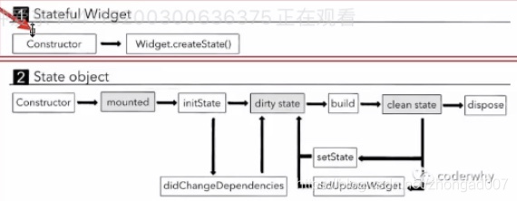

- Hot reload 主要是重新执行build方法。Hot restart 重新编译
- flutter 的运行过程中，Widget是不断的销毁和创建的
- 在State中，可以使用widget属性获取上层StatefulWidget中的自定义属性
- StatelessWidget不是一个渲染属性，MultiChildRenderObjectWidget 才是一个渲染属性
- @required 和 必传参数的区别，@required会在编译时警告，必参参数会在编译时报错
- 万物都是Widget，抽象类
- Widget：iOS中的UIButton，UIImageView，UISwitch等在Flutter中都是Widget
    - StatefulWidget：有状态的Widget，在运行过程中有一些状态需要改变
    - StatelessWidget：无状态的Widget，内容是确定的，没有状态改变


# 获取屏幕宽度

``` dart
MediaQuery.of(context).size.width
```


#  开发

``` dart

```


# StatefulWidget 生命周期 lifecycle

调用setState会进行内部更新，就会调用build方法

```
* constructor 构造器
* dispose 销毁
```



``` dart

class THomeContent extends StatefulWidget {
  THomeContent() {
    print("1");
  }

  @override
  State<THomeContent> createState() {
    print("2");
    return _THomeContentState();
  }
}

class _THomeContentState extends State<THomeContent> {

  _THomeContentState() {
    print("3");
  }

  @override
  void initState() {
    print("4");
    super.initState();
  }

  @override
  Widget build(BuildContext context) {
    print("5");
    return const Placeholder();
  }

  @override
  void dispose() {
    print("6");
    super.dispose();
  }
}

```


# 使用本地图片

``` dart
return Image(
	/// 使用本地图片
	/// 1. 创建一个文件夹
	/// 2. 在pubspec.yaml中进行配置 assets:   - assets/images/

	/// 3. 使用图片
	/// 4. $ flutter packages get
	image: AssetImage("assets/images/img1.jpg"),
);

return Image.asset("assets/images/img1.jpg");
```


# 初始架构

``` dart
MaterialApp(
	home: Scaffold(
    	appBar: AppBar(
        )
    )
)
```


``` dart

class _HYMainPageState extends State<HYMainPage> {
  int _currentIndex = 0;

  @override
  Widget build(BuildContext context) {
    return Scaffold(
      body: IndexedStack(
        index: _currentIndex,
        children: pages,
      ),
      bottomNavigationBar: BottomNavigationBar(
        selectedFontSize: 14,
        unselectedFontSize: 14,
        currentIndex: _currentIndex,
        type: BottomNavigationBarType.fixed,
        items: [BottomNavigationBarItem],
        onTap: (index) {
          setState(() {
            _currentIndex = index;
          });
        },
      ),
    );
  }
}


```


# Widget-Element-RenderObject

- 组件Widget
    - Container
    - Text
- 渲染Widget，生成RenderObject
    - Padding
    - Row

继承RenderObjectWidget的Widget就是一个渲染Widget


```
RenderObjectWidget

@protected
createRenderObject
```


所有的Widget都会创建一个对应的Element对象，创建以后会调用mount方法， _firstBuild->rebuild->performRebuild->build->built->widget.build

``` dart
Widget
	Element createElement();
```


StatefulElement 多一个_state 属性


# 状态管理
## key

``` dart
class _HYHomePageState extends State<HYHomePage> {
  final List<String> names = ["aaaa", "bbbb", "cccc"];

  @override
  Widget build(BuildContext context) {
    return Scaffold(
      appBar: AppBar(
        title: Text("列表测试"),
      ),
      body: ListView(
        children: names.map((item) {
          return ListItemFul(item, key: UniqueKey(),);
        }).toList(),
      ),
      floatingActionButton: FloatingActionButton(
        child: Icon(Icons.delete),
        onPressed: () {
          setState(() {
            names.removeAt(0);
          });
        },
      ),
    );
  }
}

class ListItemLess extends StatelessWidget {
  final String name;
  final Color randColor = Color.fromARGB(255, Random().nextInt(256), Random().nextInt(256), Random().nextInt(256));
  ListItemLess(this.name);

  @override
  Widget build(BuildContext context) {
    return Container(
      child: Text(name),
      height: 80,
      color: randColor,
    );
  }
}

class ListItemFul extends StatefulWidget {
  final String name;
  ListItemFul(this.name, {Key key}): super(key: key); // 添加key可以防止Widget复用问题

  @override
  _ListItemFulState createState() => _ListItemFulState();
}

class _ListItemFulState extends State<ListItemFul> {
  final Color randColor = Color.fromARGB(255, Random().nextInt(256), Random().nextInt(256), Random().nextInt(256));

  @override
  Widget build(BuildContext context) {
    return Container(
      child: Text(widget.name, style: TextStyle(color: Colors.white, fontSize: 30),),
      height: 80,
      color: randColor,
    );
  }
}


```


## GlobalKey

``` dart

class HYHomePage extends StatelessWidget {
  final String title = "列表测试";
  final GlobalKey<_HYHomeContentState> homeKey = GlobalKey(); // 定义GlobalKey

  @override
  Widget build(BuildContext context) {
    return Scaffold(
      appBar: AppBar(
        title: Text(title),
      ),
      body: HYHomeContent(key: homeKey), // 把 GlobalKey 传入需要访问的widget
      floatingActionButton: FloatingActionButton(
        child: Icon(Icons.gesture),
        onPressed: () {
          print(homeKey.currentState.message); // 可以访问 State 中的变量和方法
          print(homeKey.currentState.widget.name); // 可以访问 StatefulWidget 子类中的变量和方法
          homeKey.currentState.test();
        },
      ),
    );
  }
}

class HYHomeContent extends StatefulWidget {
  final String name = "coderwhy";

  HYHomeContent({Key key}): super(key: key); // 把GlobalKey传到父类

  @override
  _HYHomeContentState createState() => _HYHomeContentState();
}

class _HYHomeContentState extends State<HYHomeContent> {
  final String message = "123";

  void test() {
    print("testtesttest");
  }

  @override
  Widget build(BuildContext context) {
    return Text(message);
  }
}

```


## InheritedWidget

``` dart
// 创建 InheritedWidget
class HYCounterWidget extends InheritedWidget {
  // 1.共享的数据
  final int counter;

  // 2.定义构造方法
  HYCounterWidget({this.counter, Widget child}): super(child: child); // child: InheritedWidget包裹的widget

  // 3.获取组件最近的当前InheritedWidget
  static HYCounterWidget of(BuildContext context) {
    // 沿着Element树, 去找到最近的HYCounterElement, 从Element中取出Widget对象
    return context.dependOnInheritedWidgetOfExactType();
  }

  // 4.绝对要不要回调State中的didChangeDependencies
  // 如果返回true: 执行依赖当期的InheritedWidget的State中的didChangeDependencies
  @override
  bool updateShouldNotify(HYCounterWidget oldWidget) {
    return oldWidget.counter != counter;
  }
}
```

``` dart

class _HYHomePageState extends State<HYHomePage> {
  int _counter = 100;

  @override
  Widget build(BuildContext context) {
    return Scaffold(
      appBar: AppBar(
        title: Text("InheritedWidget"),
      ),
      body: HYCounterWidget( // 用 InheritedWidget 包裹 
        counter: _counter, // 把改变后的共享数据传入 InheritedWidget
        child: Center(
          child: Column(
            mainAxisAlignment: MainAxisAlignment.center,
            children: <Widget>[
              HYShowData01(),
              HYShowData02()
            ],
          ),
        ),
      ),
      floatingActionButton: FloatingActionButton(
        child: Icon(Icons.add),
        onPressed: () {
          setState(() {
            _counter++;
          });
        },
      ),
    );
  }
}
```

``` dart

class _HYShowData01State extends State<HYShowData01> {

  @override
  void didChangeDependencies() {
    super.didChangeDependencies();
    print("执行了_HYShowData01State中的didChangeDependencies");
  }

  @override
  Widget build(BuildContext context) {
     // context 就是 Element 数中的某个叶子
    int counter = HYCounterWidget.of(context).counter; // 使用InheritedWidget的of方法进行共享数据的访问

    return Card(
      color: Colors.red,
      child: Text("当前计数: $counter", style: TextStyle(fontSize: 30),),
    );
  }
}

class HYShowData02 extends StatelessWidget {
  @override
  Widget build(BuildContext context) {
    int counter = HYCounterWidget.of(context).counter; // 使用InheritedWidget的of方法进行共享数据的访问

    return Container(
      color: Colors.blue,
      child: Text("当前计数: $counter", style: TextStyle(fontSize: 30),),
    );
  }
}
```


## Provider 数据共享

### 创建

``` dart
void main() {
  runApp(
    // 2.在应用程序的顶层ChangeNotifierProvider
    ChangeNotifierProvider(
      create: (ctx) => HYCounterViewModel(), // 懒加载
      child: MyApp(),
    )
  );
}
```

### 创建多个Provider

``` dart
MultiProvider(
    providers: [
        ChangeNotifierProvider(create: (ctx) => HYMealViewModel()),
        ChangeNotifierProvider(create: (ctx) => HYFavorViewModel()),
    ],
    child: MyApp(),
)
```

### 创建Provider对应的ViewModel

``` dart
class HYUserViewModel extends ChangeNotifier { // 共享的ViewModel 继承 ChangeNotifier
    UserInfo _user;
    HYUserViewModel(this._user);
    UserInfo get user => _user;

    set user(UserInfo value) {
        _user = value;
        notifyListeners();
    }
}
```


### Consumer

可以理解为 Provider.of 的语法糖

``` dart
// 不会执行build方法
// 每次数据改变，Consumer里的代码都会执行
Consumer<HYCounterViewModel>(
  builder: (ctx, counterVM, child) {
    return Text("当前计数: ${counterVM.counter}", style: TextStyle(fontSize: 30),);
  },
)
```


###  Selector

``` dart
// 每次数据改变，可以通过 shouldRebuild 确定需不需要刷新
Selector<HYCounterViewModel, HYCounterViewModel>(
  selector: (ctx, counterVM) => counterVM,
  shouldRebuild: (prev, next) => false,
  builder: (ctx, counterVM, child) {
    print("floatingActionButton build方法被执行");
    return FloatingActionButton(
      child: child,
      onPressed: () {
        counterVM.counter += 1;
      },
    );
  },
  child: Icon(Icons.add), // 在这里创建然后再传入 FloatingActionButton 是避免重复构建
)
```


最终代码

``` dart

/**
 * 1.创建自己需要共享的数据
 * 2.在应用程序的顶层ChangeNotifierProvider
 * 3.在其它位置使用共享的数据
 *  > Provider.of: 当Provider中的数据发生改变时, Provider.of所在的Widget整个build方法都会重新构建
 *  > Consumer(相对推荐): 当Provider中的数据发生改变时, 重新执行Consumer的builder
 *  	> Consumer23456...... 需要使用多个共享数据时
 *  > Selector: 1.selector方法(作用,对原有的数据进行转换) 2.shouldRebuild(作用,要不要重新构建)
 */

void main() {
  runApp(
    // 2.在应用程序的顶层ChangeNotifierProvider
    ChangeNotifierProvider(
      create: (ctx) => HYCounterViewModel(), // 懒加载
      child: MyApp(),
    )
  );
}

```

``` dart
class UserInfo {
  String nickname;
  int level;
  String imageURL;

  UserInfo(this.nickname, this.level, this.imageURL);
}

class HYUserViewModel extends ChangeNotifier { // 共享的ViewModel 继承 ChangeNotifier
  UserInfo _user;

  HYUserViewModel(this._user);

  UserInfo get user => _user;

  set user(UserInfo value) {
    _user = value;
    notifyListeners();
  } 
}
```

``` dart

class HYHomePage extends StatelessWidget {
  @override
  Widget build(BuildContext context) {
    return Scaffold(
      appBar: AppBar(
        title: Text("列表测试"),
      ),
      body: Center(
        child: Column(
          mainAxisAlignment: MainAxisAlignment.center,
          children: <Widget>[
            HYShowData01(),
            HYShowData02()
          ],
        ),
      ),
      floatingActionButton: Selector<HYCounterViewModel, HYCounterViewModel>(
        selector: (ctx, counterVM) => counterVM,
        shouldRebuild: (prev, next) => false,
        builder: (ctx, counterVM, child) {
          print("floatingActionButton build方法被执行");
          return FloatingActionButton(
            child: child,
            onPressed: () {
              counterVM.counter += 1;
            },
          );
        },
        child: Icon(Icons.add), // 在这里创建然后再传入 FloatingActionButton 是避免重复构建
      )
    );
  }
}

class HYShowData01 extends StatelessWidget {
  @override
  Widget build(BuildContext context) {
    // 3.在其它位置使用共享的数据
    int counter = Provider.of<HYCounterViewModel>(context).counter; // of方式访问，会执行build方法，效率低
	// 当前计数: $counter”
  }
}

return Container(
  color: Colors.red,
  child: Consumer<HYCounterViewModel>( // Consumer 方式访问，不会执行build方法，效率高，每次数据改变，Consumer里的代码都会执行
    builder: (ctx, counterVM, child) {
      print("data02 Consumer build方法被执行");
      return Text("当前计数: ${counterVM.counter}", style: TextStyle(fontSize: 30),);
    },
  ),
);
```


使用多个Provider

``` dart
List<SingleChildWidget> providers = [
  ChangeNotifierProvider(create: (ctx) => HYCounterViewModel(),),
  ChangeNotifierProvider(create: (ctx) => HYUserViewModel(UserInfo("why", 29, "abc")),),
];

void main() => runApp(

  MultiProvider(
    providers: [HYCounterViewModel()],
    child: MyApp(),
  )
);

```


- 监听调用
    - Provider.of\<T>(context) | context.watch\<T>(context)
    - 只能在StatelessWidget.build 和 State.build 中使用
    - 监听值发生变化时，会重建组件
- 非监听调用
    - Provider.of\<T>(context, listen: false) | context.read\<T>(context)
    - 不能在 StatelessWidget.build 或 State.build 中使用


# 事件监听

- Pointer
    - Listener
- Gesture
    - GestureDetector
        - globalPosition
        - localPosition

IgnorePointer

## 点击

```dart
// 添加手势，onTapUp、onTapDown、onDoubleTap、onLongPressUp
GestureDetector

// 添加水波纹点击效果
InkWell
```


## event_bus 事件总线

- 创建一个全局的EventBus对象

``` dart
// 1.创建全局的EventBus对象
final eventBus = EventBus();

// 2.发出事件
eventBus.fire(info);

// 3.监听事件的类型
eventBus.on<UserInfo>().listen((data) {
     
});
```


# 动画

- Animation

- AnimationController

    - forward 向前执行动画
    - reverse 反转动画

- CurvedAnimation

    - 速度曲线

- Tween

    - value范围

- AnimatedWidget
    ``` dard
    
    class HYAnimatedIcon extends AnimatedWidget {
    //  final Animation _sizeAnim;
      HYAnimatedIcon(Animation anim): super(listenable: anim);
    
      @override
      Widget build(BuildContext context) {
        Animation anim = listenable;
        return Icon(Icons.favorite, color: Colors.red, size: anim.value,);
      }
    }
    ```

    

- AnimatedBuilder
    ``` dart
    AnimatedBuilder(
        animation: _controller,
        builder: (ctx, child) {
          return Icon(Icons.favorite, color: Colors.red, size: _sizeAnim.value);
        }
    ),
    ```

    

``` dart

class _HYHomePageState extends State<HYHomePage> with SingleTickerProviderStateMixin {
  // 创建AnimationController
  AnimationController _controller;
  Animation _animation;
  Animation _sizeAnim;

//  bool _isForward;

  @override
  void initState() {
    super.initState();

    // 1.创建AnimationController
    _controller = AnimationController(
        vsync: this,
        duration: Duration(seconds: 2)
    );

    // 2.设置Curve的值
    _animation = CurvedAnimation(parent: _controller, curve: Curves.linear);

    // 3.Tween
    _sizeAnim = Tween(begin: 50.0, end: 150.0).animate(_animation);

    // 监听动画值的改变
    _controller.addListener(() {
      setState(() {});
    });

    // 监听动画的状态改变
    _controller.addStatusListener((status) {
      if (status == AnimationStatus.completed) {
        _controller.reverse();
      } else if (status == AnimationStatus.dismissed) {
        _controller.forward();
      }
    });
  }

  @override
  Widget build(BuildContext context) {
    return Scaffold(
      appBar: AppBar(
        title: Text("首页"),
      ),
      body: Center(
        child: Icon(Icons.favorite, color: Colors.red, size: _sizeAnim.value,),
      ),
      floatingActionButton: FloatingActionButton(
        child: Icon(Icons.play_arrow),
        onPressed: () {
          if (_controller.isAnimating) {
            _controller.stop();
            print(_controller.status);
          } else if (_controller.status == AnimationStatus.forward) {
            _controller.forward();
          } else if (_controller.status == AnimationStatus.reverse) {
            _controller.reverse();
          } else {
            _controller.forward();
          }
        },
      ),
    );
  }

  @override
  void dispose() {
    _controller.dispose();
    super.dispose();
  }
}

```


## 交织动画

Staggered animations

``` dart

class _HYHomePageState extends State<HYHomePage>
    with SingleTickerProviderStateMixin {
  // 创建AnimationController
  AnimationController _controller;
  Animation _animation;

  Animation _sizeAnim;
  Animation _colorAnim;
  Animation _opacityAnim;
  Animation _radiansAnim;

  @override
  void initState() {
    super.initState();

    // 1.创建AnimationController
    _controller = AnimationController(
        vsync: this,
        duration: Duration(seconds: 2)
    );

    // 2.设置Curve的值
    _animation = CurvedAnimation(parent: _controller, curve: Curves.linear);

    // 3.Tween
    // 3.1.创建size的tween
    _sizeAnim = Tween(begin: 10.0, end: 200.0).animate(_controller);
    // 3.2.创建color的tween
    _colorAnim = ColorTween(begin: Colors.orange, end: Colors.purple).animate(_controller);
    // 3.3.创建opacity的tween
    _opacityAnim = Tween(begin: 0.0, end: 1.0).animate(_controller);
    // 3.4.创建radians的tween
    _radiansAnim = Tween(begin: 0.0, end: 2 * pi).animate(_controller);

//    _controller.addListener(() {
//      setState(() {
//
//      });
//    });

    // 监听动画的状态改变
    _controller.addStatusListener((status) {
      if (status == AnimationStatus.completed) {
        _controller.reverse();
      } else if (status == AnimationStatus.dismissed) {
        _controller.forward();
      }
    });
  }

  @override
  Widget build(BuildContext context) {
    print("执行_HYHomePageState的build方法");
    /**
     * 1.大小变化动画
     * 2.颜色变化动画
     * 3.透明度变化动画
     */
    return Scaffold(
      appBar: AppBar(
        title: Text("首页"),
      ),
      body: Center(
        child: AnimatedBuilder(
          animation: _controller,
          builder: (ctx, child) {
            return Opacity(
              opacity: _opacityAnim.value,
              child: Transform(
                transform: Matrix4.rotationZ(_radiansAnim.value),
                alignment: Alignment.center, // 解决旋转中心点问题
                child: Container(
                  width: _sizeAnim.value,
                  height: _sizeAnim.value,
                  color: _colorAnim.value,
                ),
              ),
            );
          },
        )
      ),
      floatingActionButton: FloatingActionButton(
        child: Icon(Icons.play_arrow),
        onPressed: () {
          if (_controller.isAnimating) {
            _controller.stop();
            print(_controller.status);
          } else if (_controller.status == AnimationStatus.forward) {
            _controller.forward();
          } else if (_controller.status == AnimationStatus.reverse) {
            _controller.reverse();
          } else {
            _controller.forward();
          }
        },
      ),
    );
  }

  @override
  void dispose() {
    _controller.dispose();
    super.dispose();
  }
}

```


## Hero 动画

无缝衔接的预览一张图片

``` dart
GestureDetector(
    onTap: () {
        Navigator.of(context).pop();
    },
    child: Hero(tag: _imageURL, child: Image.network(_imageURL))
)
```

``` dart
Row(
    children: <Widget>[
        Hero(
            tag: _imageURL,
            child: CachedNetworkImage(
                imageUrl: Image.network(_imageURL),
                placeholder: (context, url) => Container(
                    height: 200.0,
                    width: 130.0,
                    child: LoadingWidget(),
                ),
                errorWidget: (context, url, error) => Icon(Feather.x),
                fit: BoxFit.cover,
                height: 200.0,
                width: 130.0,
            ),
        )
    ]
)

```


  

# Json 解析

``` dart
// 1. 加载json文件
    final jsonString = await rootBundle.loadString("assets/json/category.json");
    // 2. 将jsonString 转 Map/List
    final result = json.decode(jsonString);
    // 3. 将Map中的内容转成对象
    final resultList = result["category"];
    List<LFCategoryModel> categories = [];
    for (var json in resultList) {
      categories.add(LFCategoryModel.fromJson(json));
    }
```


# 打开抽屉

``` dart
class HYHomeAppBar extends AppBar {
    HYHomeAppBar(BuildContext context) : super(
        title: Text("美食广场"),
        leading: Builder( // 这里要使用builder来获取context，不能直接使用外层的context
            builder: (ctx) {
                return IconButton(
                    icon: Icon(Icons.build),
                    onPressed: () {
                        Scaffold.of(ctx).openDrawer();
                    },
                );
            },
        ));
}
```


# 与原生交互

## Camera

``` dart
dependencies:
  image_picker: ^0.6.5
```

``` dart
File image = await ImagePicker.pickImage(source: ImageSource.gallery);
setState(() {
    _image = image;
});
```


## 方法调用

- Flutter
    - MethodChannel
- iOS
    - FlutterMethodChannel
- Android
    - MethodChannel

``` dart
static const platform = const MethodChannel("coderwhy.com/battery");

void getBatteryInfo() async {
    // 调用原生方法
    final int result = await platform.invokeMethod("getBatteryInfo");
    setState(() {
        _result = result;
    });
}
```

swift代码

``` swift
// 1.获取FlutterViewController(是应用程序的默认Controller)
let controller : FlutterViewController = window?.rootViewController as! FlutterViewController

// 2.获取MethodChannel(方法通道)
let batteryChannel = FlutterMethodChannel(name: "coderwhy.com/battery",
                                          binaryMessenger: controller.binaryMessenger)

// 3.监听方法调用(会调用传入的回调函数)
batteryChannel.setMethodCallHandler({
    [weak self] (call: FlutterMethodCall, result: FlutterResult) -> Void in
    // 3.1.判断是否是getBatteryInfo的调用,告知Flutter端没有实现对应的方法
    guard call.method == "getBatteryInfo" else {
        result(FlutterMethodNotImplemented)
        return
    }
    
    // 3.2.如果调用的是getBatteryInfo的方法, 那么通过封装的另外一个方法实现回调
	// 如果没有获取到,那么返回给Flutter端一个异常
    if device.batteryState == UIDevice.BatteryState.unknown {
        result(FlutterError(code: "UNAVAILABLE",
                            message: "Battery info unavailable",
                            details: nil))
    } else {
        // 通过result将结果回调给Flutter端
        result(Int(device.batteryLevel * 100))
    }
})

GeneratedPluginRegistrant.register(with: self)

```


# 事件回调

## WidgetsBinding.instance.addPostFrameCallback

- **addPostFrameCallback** 是 StatefulWidget 渲染结束的回调，只会被调用一次，之后 StatefulWidget 需要刷新 UI 也不会被调用，
- **addPostFrameCallback** 的使用方法是在 initState 里添加回调：


# BuildContext

实际上就是Element对象，BuildContext 接口用于阻止对 Element 对象的直接操作。

of实际上是对context跨组件获取数据的一个封装


