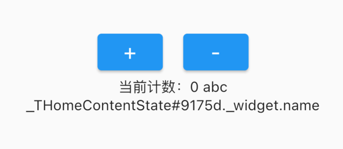

```dart
import 'package:flutter/material.dart';

main() => runApp(MyApp());

class MyApp extends StatelessWidget {
  const MyApp({Key? key}) : super(key: key);

  @override
  Widget build(BuildContext context) {
    return MaterialApp(
      home: THomePage()
    );
  }
}

class THomePage extends StatelessWidget {
  @override
  Widget build(BuildContext context) {
    return Scaffold(
      appBar: AppBar(
        title: Text("abc"),
      ),
      body: THomeContent()
    );
  }
}

class THomeContent extends StatefulWidget {
  var name = "abc";

  @override
  State<StatefulWidget> createState() {
    return _THomeContentState();
  }
}

class _THomeContentState extends State<THomeContent> {
  var _number = 0;

  @override
  Widget build(BuildContext context) {
    return Center(
      child: Column(
        mainAxisAlignment: MainAxisAlignment.center,
        children: <Widget>[
          _getButtons(),
          Text("当前计数：$_number ${widget.name}"), // 获取 THomeContent 中的 name 属性
          Text("$this._widget.name")
        ],
      ),
    );
  }

  Widget _getButtons() {
    final ButtonStyle style =
    ElevatedButton.styleFrom(textStyle: const TextStyle(fontSize: 20, color: Colors.red));
    return Row(
      mainAxisAlignment: MainAxisAlignment.center,
      children: <Widget>[
        ElevatedButton(
            onPressed: (){
              print("点击了+");
              setState(() {
                ++_number;
              });
            },
            child: Text("+"),
            style: style
        ),
        SizedBox(width: 20,),
        ElevatedButton(
            onPressed: (){
              print("点击了-");
              --_number;
              setState(() {

              });
            },
            child: Text("-"),
            style: style
        )
      ],
    );
  }
}
```