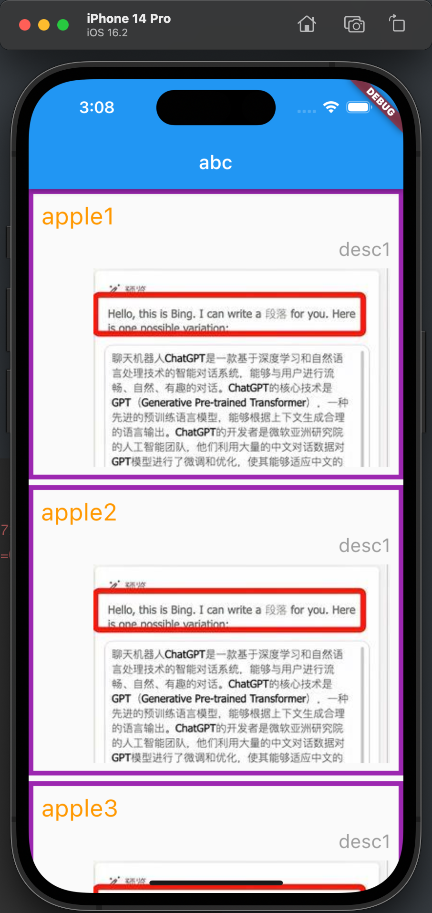
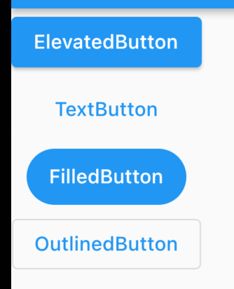
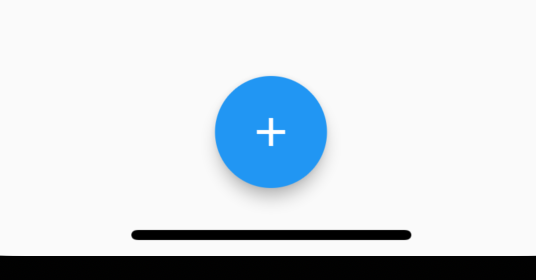

``` dart
import 'package:flutter/material.dart';

main() => runApp(MyApp());

class MyApp extends StatelessWidget {
  const MyApp({Key? key}) : super(key: key);

  @override
  Widget build(BuildContext context) {
    return MaterialApp(
      home: THomePage()
    );
  }
}

class THomePage extends StatelessWidget {
  @override
  Widget build(BuildContext context) {
    return Scaffold(
      appBar: AppBar(
        title: Text("abc"),
      ),
      body: THomeContent()
    );
  }
}

var url = "https://gimg3.baidu.com/search/src=http%3A%2F%2Fpics6.baidu.com%2Ffeed%2F728da9773912b31bdf23e32341218e71dab4e136.jpeg%40f_auto%3Ftoken%3Da2e15feee276489674ddca1cd39d7dae&refer=http%3A%2F%2Fwww.baidu.com&app=2021&size=f360,240&n=0&g=0n&q=75&fmt=auto?sec=1676480400&t=82abcb86601b7758d6746ccc233cb7e5";

class THomeContent extends StatelessWidget {
  const THomeContent({Key? key}) : super(key: key);

  @override
  Widget build(BuildContext context) {
    return ListView(
      children: <Widget>[
        THomeProductItem("apple1", "desc1", url),
        SizedBox(height: 6,),
        THomeProductItem("apple2", "desc1", url),
        SizedBox(height: 6,),
        THomeProductItem("apple3", "desc1", url),
        SizedBox(height: 6,),
        THomeProductItem("apple3", "desc1", url),
        SizedBox(height: 6,),
        THomeProductItem("apple3", "desc1", url),
        SizedBox(height: 6,),
        THomeProductItem("apple3", "desc1", url),
      ],
    );
  }
}

class THomeProductItem extends StatelessWidget {
  final String title;
  final String desc;
  final String imageURL;

  final style1 = TextStyle(fontSize: 25, color: Colors.orange);
  final style2 = TextStyle(fontSize: 20, color: Colors.grey);

  THomeProductItem(this.title, this.desc, this.imageURL);

  @override
  Widget build(BuildContext context) {
    return Container( // 可以添加边框 decoration
      padding: EdgeInsets.all(8),
      decoration: BoxDecoration( // 装饰 边框
        border: Border.all(
          width: 5,
          color: Colors.purple
        )
      ),
      child: Column( // 垂直布局
        crossAxisAlignment: CrossAxisAlignment.end,
        children: <Widget>[
          Row(
            mainAxisAlignment: MainAxisAlignment.start,
            children: [
              Text(title, style: style1, textAlign: TextAlign.right,),
            ],
          ),
          SizedBox(height: 8,),
          Text(desc, style: style2),
          SizedBox(height: 8,),
          Image.network(imageURL)
        ]
      ),
    );
  }
}
```




```dart
ElevatedButton(onPressed: () {}, child: Text("ElevatedButton")), // 高的按钮
TextButton(onPressed: (){}, child: Text("TextButton")), // 文本按钮
FilledButton(onPressed: (){}, child: Text("FilledButton")), // 填满的按钮（圆角）
OutlinedButton(onPressed: (){}, child: Text("OutlinedButton")) // 轮廓按钮
```




```dart
class THomePage extends StatelessWidget {
  @override
  Widget build(BuildContext context) {
    return Scaffold(
      floatingActionButton: FloatingActionButton(
        onPressed: () {  },
        child: Icon(Icons.add),
      ),
      floatingActionButtonLocation: FloatingActionButtonLocation.centerDocked,
    );
  }
}
```

