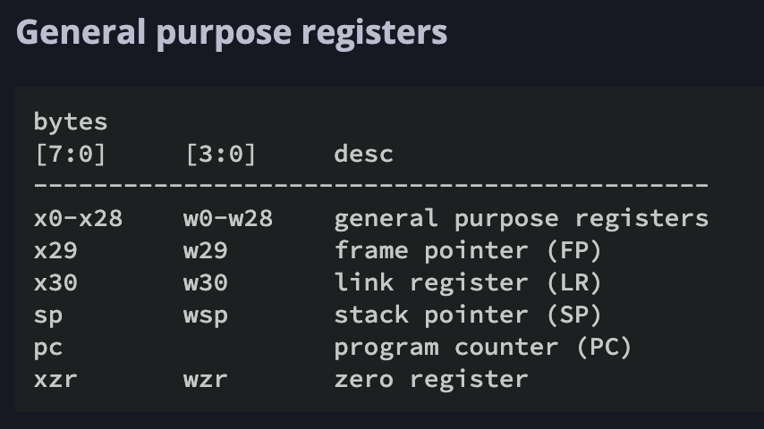

Objective C源文件(.m)的编译器是Clang + LLVM，Swift源文件的编译器是swiftc + LLVM。

# 寄存器

## 通用寄存器 General purpose registers

ARM64 有34个寄存器，包括31个通用寄存器、SP、PC、CPSR。

x0表示64位，w0表示低32位

- X0~X7：用于传递子程序参数和结果，使用时不需要保存，多余参数采用堆栈传递，64位返回结果采用X0表示，128位返回结果采用X1:X0表示。
- X8：用于保存子程序返回地址， 尽量不要使用 
- FP（frame pointer）(x29)：保存函数栈的基地址(栈底指针)。
- LR（link register）(x30)：程序链接寄存器，保存子程序结束后需要执行的下一条指令的内存地址。
- SP（stack pointer）(X31)：可以把栈理解为存储数据的容器，而Stack Pointer告诉你这个容器有多高，你可以通过移动Stack Pointer来增加/减少你的容器容量。
- PC（program counter）：程序计数器，俗称PC指针，总是指向即将要执行的下一条指令,在arm64中，软件是不能改写PC寄存器的。
- CPSR：状态寄存器





### CPSR(状态寄存器)

NZCV是状态寄存器的条件标志位，分别代表运算过程中产生的状态，其中：

- N, negative condition flag，一般代表运算结果是负数
- Z, zero condition flag, 指令结果为0时Z=1，否则Z=0；
- C, carry condition flag, 无符号运算有溢出时，C=1。
- V, oVerflow condition flag 有符号运算有溢出时，V=1。


# LLDB命令

### 获取所有寄存器

``` shell
# 获取所有寄存器
(lldb) register read
General Purpose Registers:
        x0 = 0x0000000000000001
        x1 = 0x00000001f1309498  libswiftCore.dylib`type metadata for Any + 8
        x2 = 0x000000016fdff5c8
        x3 = 0x000000016fdff6b0
        x4 = 0x000000016fdfedc8
        x5 = 0x0000000194c04c2c  dyld`lsl::EphemeralAllocator::allocate_buffer(unsigned long, unsigned long, unsigned long, lsl::Allocator**)
        x6 = 0x00000001f1c66cf0  dyld`vtable for lsl::EphemeralAllocator + 72
        x7 = 0x0000000000000000
        x8 = 0x0000000000000001
        x9 = 0x0000000100008000  Test`Test.e : Test.TestEnum
       x10 = 0x0000000100008000  Test`Test.e : Test.TestEnum
       x11 = 0x0000000000000002
       x12 = 0x000000016fdff25a
       x13 = 0x0000000000000001
       x14 = 0x0000000000000001
       x15 = 0xffffffffffffffff
       x16 = 0x000000000000004a
       x17 = 0x82ca0001f1c66d28
       x18 = 0x0000000000000000
       x19 = 0x0000000100016010
       x20 = 0x0000000100003a6c  Test`main at main.swift
       x21 = 0x0000000100016030
       x22 = 0x000000016fdff440
       x23 = 0x0000000194c51000  dyld`objc_visitor::Visitor::forEachClass(bool, objc_visitor::Visitor::DataSection const&, void (objc_visitor::Class&, bool, bool&) block_pointer) (.cold.1) + 24
       x24 = 0x00000001f0773340  gProcessInfo
       x25 = 0x0000000000000000
       x26 = 0x0000000000000000
       x27 = 0x0000000000000000
       x28 = 0x0000000000000000
        fp = 0x000000016fdff2a0
        lr = 0x0000000194bdbe50  dyld`start + 2544
        sp = 0x000000016fdff260
        pc = 0x0000000100003ab4  Test`main + 72 at main.swift:16:7
      cpsr = 0x60001000
```

### step

``` shell
# 单步运行，把子函数当做整体一步执⾏（源码级别）
$ thread step-over、next、n

# 单步运⾏，遇到子函数会进⼊子函数（源码级别）
$ thread step-in、step、s

# 单步运⾏，把子函数当做整体一步执行（汇编级别）
$ thread step-inst-over、nexti、ni

# 单步运行，遇到子函数会进⼊子函数（汇编级别）
$ thread step-inst、stepi、si

# 直接执⾏完当前函数的所有代码，返回到上一个函数（遇到断点会卡住）
$ thread step-out、finish
```


# 指令


### MOV

Move (register).

General Instructions 通用指令

官方文档：https://developer.arm.com/documentation/100069/0609/A64-General-Instructions/MOV--register-

```assembly
MOV    X1，X0         # 将寄存器X0的值传送到寄存器X1
```

### ADD

Add (immediate).

immediate：立即数

官方文档：https://developer.arm.com/documentation/dui0802/a/A64-General-Instructions/ADD--immediate-

``` assembly
# X0 = X1 + X2
ADD    X0，X1，X2     # 寄存器X1和X2的值相加后传送到X0
```

### SUB

[Subtract (extended register).](https://developer.arm.com/documentation/dui0802/a/A64-General-Instructions/SUB--extended-register-)

[Subtract (immediate).](https://developer.arm.com/documentation/dui0802/a/A64-General-Instructions/SUB--immediate-)

[Subtract (shifted register).](https://developer.arm.com/documentation/dui0802/a/A64-General-Instructions/SUB--shifted-register-)

``` assembly
# X0 = X1 - X2
SUB    X0，X1，X2     # 寄存器X1和X2的值相减后传送到X0
```


```css
MOV    X1，X0         ;将寄存器X0的值传送到寄存器X1
ADD    X0，X1，X2     ;寄存器X1和X2的值相加后传送到X0
SUB    X0，X1，X2     ;寄存器X1和X2的值相减后传送到X0

AND    X0，X0，#0xF    ; X0的值与0xF相位与后的值传送到X0
ORR    X0，X0，#9      ; X0的值与9相位或后的值传送到X0
EOR    X0，X0，#0xF    ; X0的值与0xF相异或后的值传送到X0

LDR    X5，[X6，#0x08]        ；ld：load; X6寄存器加0x08的和的地址值内的数据传送到X5
LDP  x29, x30, [sp, #0x10]    ; ldp :load pair ; 一对寄存器, 从内存读取数据到寄存器

STR X0, [SP, #0x8]         ；st:store,str:往内存中写数据（偏移值为正）; X0寄存器的数据传送到SP+0x8地址值指向的存储空间
STUR   w0, [x29, #-0x8]   ;往内存中写数据（偏移值为负）
STP  x29, x30, [sp, #0x10]    ;store pair，存放一对数据, 入栈指令

CBZ  ;比较（Compare），如果结果为零（Zero）就转移（只能跳到后面的指令）
CBNZ ;比较，如果结果非零（Non Zero）就转移（只能跳到后面的指令）
CMP  ;比较指令，相当于SUBS，影响程序状态寄存器CPSR 

B   ;跳转指令，可带条件跳转与cmp配合使用
BL  ;带返回的跳转指令， 返回地址保存到LR（X30）
BLR  ; 带返回的跳转指令，跳转到指令后边跟随寄存器中保存的地址(例：blr    x8 ;跳转到x8保存的地址中去执行)
RET   ;子程序返回指令，返回地址默认保存在LR（X30）
```


# 相关链接

https://johannst.github.io/notes/arch/arm64.html