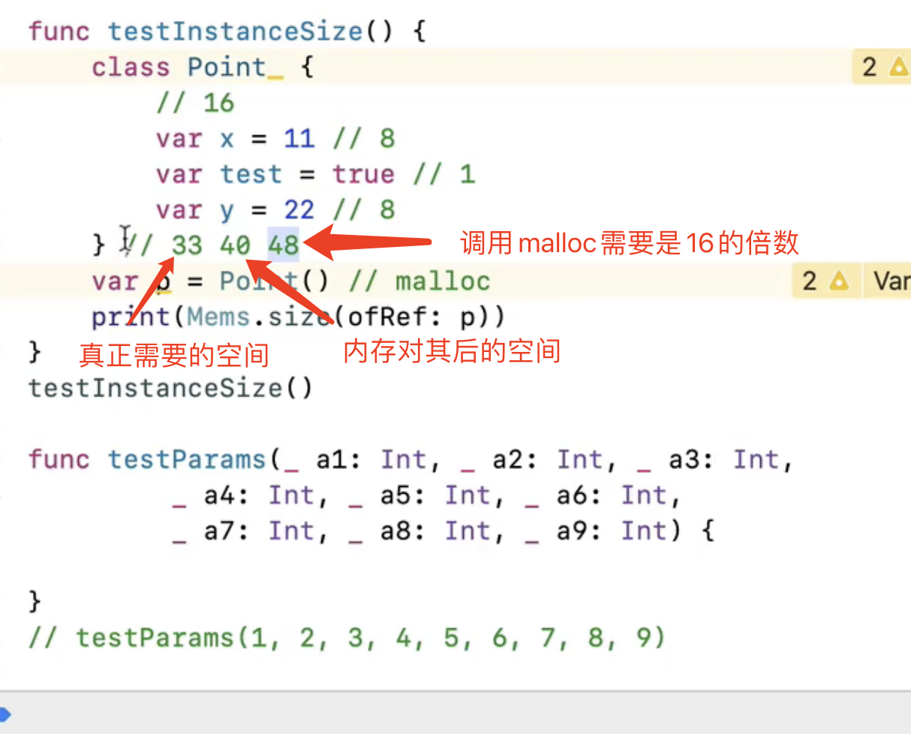

``` swift
print(MemoryLayout<Int>.size) // 实际占用大小
print(MemoryLayout<Int>.stride) // 开辟内存大小
print(MemoryLayout<Int>.alignment) // 内存对其大小
```


汇编进入函数调用 si


### AT&T 汇编

$立即数

rip：CPU要执行的下一条语句的地址

当前断点执行时的rip，其实是下一条指令的地址，并不是当前断点暂停时，用 register read 读取的值


malloc_size : 查看指针变量指向的堆空间的大小，如果指针变量指向的是栈空间，返回0





获取类型

