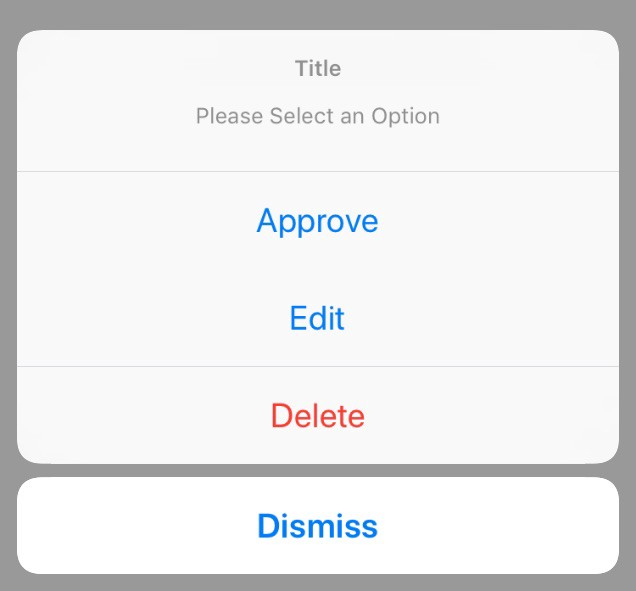
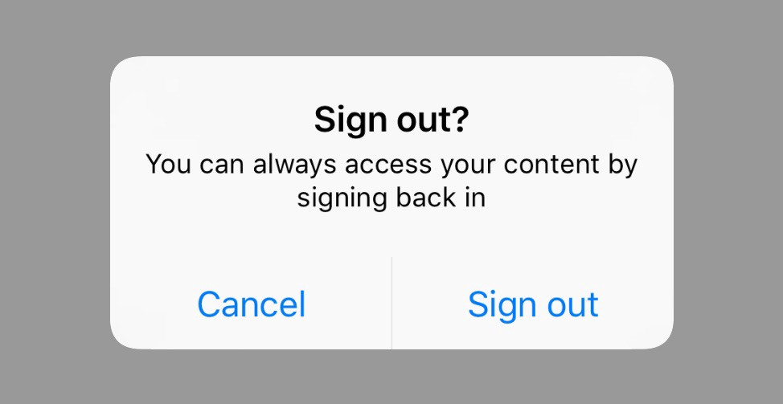

https://medium.com/swift-india/uialertcontroller-in-swift-22f3c5b1dd68

### Simple action sheet

``` swift
let alert = UIAlertController(title: "Title", message: "Please Select an Option", preferredStyle: .actionSheet)
alert.addAction(UIAlertAction(title: "Approve", style: .default, handler: { (_) in
    print("User click Approve button")
}))

alert.addAction(UIAlertAction(title: "Edit", style: .default, handler: { (_) in
    print("User click Edit button")
}))

alert.addAction(UIAlertAction(title: "Delete", style: .destructive, handler: { (_) in
    print("User click Delete button")
}))

alert.addAction(UIAlertAction(title: "Dismiss", style: .cancel, handler: { (_) in
    print("User click Dismiss button")
}))

self.present(alert, animated: true, completion: {
    print("completion block")
})
```



### Simple alert
``` swift
let alert = UIAlertController(title: "Sign out?", message: "You can always access your content by signing back in",         preferredStyle: UIAlertControllerStyle.alert)

alert.addAction(UIAlertAction(title: "Cancel", style: UIAlertActionStyle.default, handler: { _ in
    //Cancel Action
}))
alert.addAction(UIAlertAction(title: "Sign out",
                                style: UIAlertActionStyle.default,
                                handler: {(_: UIAlertAction!) in
                                //Sign out action
}))
self.present(alert, animated: true, completion: nil)
```
