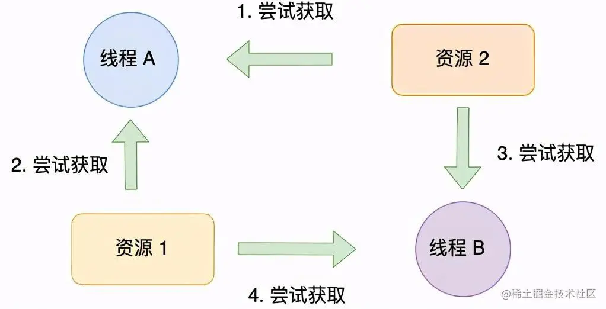

### 向主线程同步派发一个block任务会照成死锁

```objectivec
 - (void)viewDidLoad {
    [super viewDidLoad];
    // Do any additional setup after loading the view, typically from a nib.
  
    dispatch_queue_t mainQueue = dispatch_get_main_queue();
//    dispatch_sync(mainQueue, ^{
//        //代码无法执行
//        NSLog(@"在主线程中同步执行block任务形成死锁");
//    });
    //改成async避免死锁
    dispatch_async(mainQueue, ^{
            //代码无法执行
            NSLog(@"在主线程中异步执行block任务不形成死锁");
    });
}
```

> 原因：主队列是串行队列，执行同步派发(dispatch_sync)时将等待其派发的block任务执行完毕后再返回，即不是立即返回，阻塞在此。
> 而block任务由于处在串行队列中，需要等前面派发的代码执行完毕才能执行，形成死锁。


### 串行队列添加同步任务会造成死锁

### 死锁的概念

在多线程编程中，我们为了防止多线程竞争共享资源而导致数据错乱，都会在操作共享资源之前加上互斥锁，只有成功获得到锁的线程，才能操作共享资源，获取不到锁的线程就只能等待，直到锁被释放。
那么，当两个线程为了保护两个不同的共享资源而使用了两个互斥锁，那么这两个互斥锁应用不当的时候，可能会造成两个线程都在等待对方释放锁，在没有外力的作用下，这些线程会一直相互等待，就没办法继续运行，这种情况就是发生了死锁。
举个例子，小林拿了小美房间的钥匙，而小林在自己的房间里，小美拿了小林房间的钥匙，而小美也在自己的房间里。如果小林要从自己的房间里出去，必须拿到小美手中的钥匙，但是小美要出去，又必须拿到小林手中的钥匙，这就形成了死锁。
死锁只有同时满足以下四个条件才会发生：

##### 互斥条件（互斥）

一个资源同时只能有一个线程使用
比如下图，如果线程 A 已经持有的资源，不能再同时被线程 B 持有，如果线程 B 请求获取线程 A 已经占用的资源，那线程 B 只能等待，直到线程 A 释放了资源。


##### 持有并等待条件（占有且等待）

一个进程因请求资源而阻塞时，对已获得的资源保持不放。
持有并等待条件是指，当线程 A 已经持有了资源 1，又想申请资源 2，而资源 2 已经被线程 C 持有了，所以线程  A 就会处于等待状态，但是线程  A 在等待资源 2 的同时并不会释放自己已经持有的资源 1。


##### 不可剥夺条件（不可抢占）

进程已获得的资源，在末使用完之前，不能强行剥夺。
不可剥夺条件是指，当线程已经持有了资源 ，在自己使用完之前不能被其他线程获取，线程 B 如果也想使用此资源，则只能在线程 A 使用完并释放后才能获取。


##### 环路等待条件（循环等待）

若干进程之间形成一种头尾相接的循环等待资源关系。
环路等待条件指都是，在死锁发生的时候，两个线程获取资源的顺序构成了环形链。
比如，线程 A 已经持有资源 2，而想请求资源 1， 线程 B 已经获取了资源 1，而想请求资源 2，这就形成资源请求等待的环形图。


```objectivec
- (void)test1 {
    dispatch_queue_t queue = dispatch_queue_create("com.demo.serialQueue", DISPATCH_QUEUE_SERIAL);
    NSLog(@"1"); // 任务1
    dispatch_async(queue, ^{
        NSLog(@"2"); // 任务2
        dispatch_sync(queue, ^{ // Thread 4: EXC_BAD_INSTRUCTION (code=EXC_I386_INVOP, subcode=0x0)
            NSLog(@"3"); // 任务3
        });
        NSLog(@"4"); // 任务4
    });
    NSLog(@"5"); // 任务5
    /*
     2021-10-29 15:09:30.764462+0800 TestThread[27844:1695410] 1
     2021-10-29 15:09:30.764727+0800 TestThread[27844:1695410] 5
     2021-10-29 15:09:30.764756+0800 TestThread[27844:1695502] 2
     */
}

- (void)test2 {
    dispatch_queue_t aSerialDispatchQueue = dispatch_queue_create("com.test.deadlock.queue", DISPATCH_QUEUE_SERIAL);
    NSLog(@"1"); //任务1
    dispatch_sync(aSerialDispatchQueue, ^{
        NSLog(@"2"); //任务2
        dispatch_sync(aSerialDispatchQueue, ^{ // Thread 1: EXC_BAD_INSTRUCTION (code=EXC_I386_INVOP, subcode=0x0)
            NSLog(@"3"); //任务3
        });
        NSLog(@"4"); //任务4
    });
    NSLog(@"5"); //任务5
  
    /*
     2021-10-29 15:07:08.164523+0800 TestThread[27791:1692738] 1
     2021-10-29 15:07:08.164701+0800 TestThread[27791:1692738] 2
     */
}
```
