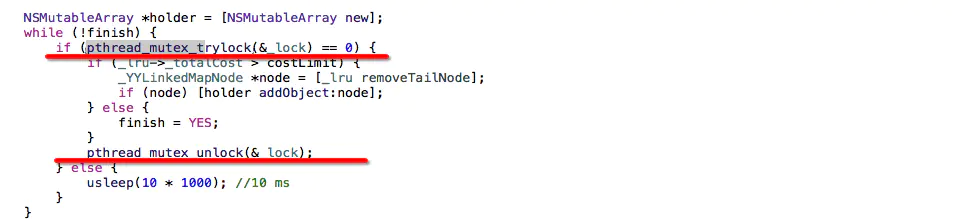

``` objective-c
#import <pthread.h>

static pthread_mutex_t pLock;
pthread_mutex_init(&pLock, NULL);
//1.线程1
dispatch_async(dispatch_get_global_queue(DISPATCH_QUEUE_PRIORITY_DEFAULT, 0), ^{
    NSLog(@"线程1 准备上锁");
    pthread_mutex_lock(&pLock);
    sleep(3);
    NSLog(@"线程1");
    pthread_mutex_unlock(&pLock);
});

//1.线程2
dispatch_async(dispatch_get_global_queue(DISPATCH_QUEUE_PRIORITY_DEFAULT, 0), ^{
    NSLog(@"线程2 准备上锁");
    pthread_mutex_lock(&pLock);
    NSLog(@"线程2");
    pthread_mutex_unlock(&pLock);
});
```

### pthread_mutex_trylock
函数成功返回0。任何其他返回值都表示错误。
函数pthread_mutex_trylock是pthread_mutex_lock的非阻塞版本。如果mutex参数所指定的互斥锁已经被锁定的话，调用pthread_mutex_trylock函数不会阻塞当前线程，而是立即返回一个值来描述互斥锁的状况。
