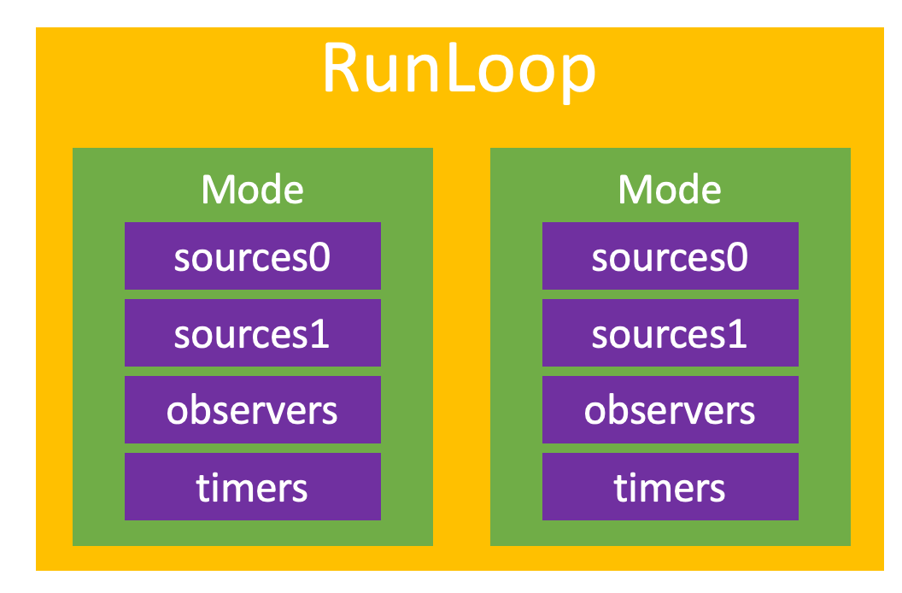
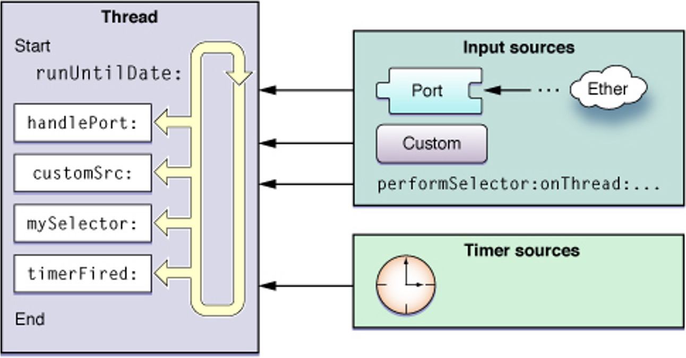
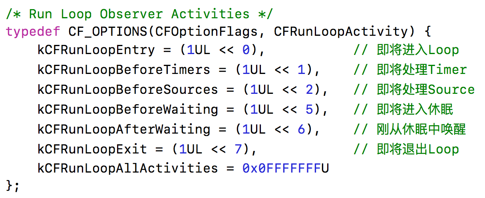

# 什么是Runloop

- 运行循环
- 在程序运行过程中循环做一些事情
- 懒加载-使用的时候才会创建，在子线程中创建定时器时，要确保子线程的runloop被创建


应用范畴
- 定时器（Timer）、PerformSelector
- GCD Async Main Queue
- 事件响应、手势识别、界面刷新
- 网络请求
- AutoreleasePool


RunLoop的基本作用

- 保持程序的持续运行
- 处理App中的各种事件（比如触摸事件、定时器事件等）
- 节省CPU资源，提高程序性能：该做事时做事，该休息时休息
- ......


# RunLoop对象

iOS中有2套API来访问和使用RunLoop
- Foundation：NSRunLoop
- Core Foundation：CFRunLoopRef


NSRunLoop和CFRunLoopRef都代表着RunLoop对象
- NSRunLoop是基于CFRunLoopRef的一层OC包装
- CFRunLoopRef是开源的 https://opensource.apple.com/tarballs/CF/


# RunLoop与线程

- 每条线程都有唯一的一个与之对应的RunLoop对象
- RunLoop保存在一个全局的Dictionary里，线程作为key，RunLoop作为value
- 线程刚创建时并没有RunLoop对象，RunLoop会在第一次获取它时创建
- RunLoop会在线程结束时销毁
- 主线程的RunLoop已经自动获取（创建），子线程默认没有开启RunLoop


# 获取RunLoop对象

``` objc
// Foundation
[NSRunLoop currentRunLoop]; // 获得当前线程的RunLoop对象
[NSRunLoop mainRunLoop]; // 获得主线程的RunLoop对象

// Core Foundation
CFRunLoopGetCurrent(); // 获得当前线程的RunLoop对象
CFRunLoopGetMain(); // 获得主线程的RunLoop对象

```


# RunLoop相关的类

Core Foundation中关于RunLoop的5个类
- CFRunLoopRef
- CFRunLoopModeRef
- CFRunLoopSourceRef
- CFRunLoopTimerRef
- CFRunLoopObserverRef

``` c
typedef struct __CFRunLoop * CFRunLoopRef;
struct __CFRunLoop {
    // CFRuntimeBase _base;
    // pthread_mutex_t _lock;			/* locked for accessing mode list */
    // __CFPort _wakeUpPort;			// used for CFRunLoopWakeUp 
    // Boolean _unused;
    // volatile _per_run_data *_perRunData;              // reset for runs of the run loop
    pthread_t _pthread;
    // uint32_t _winthread;
    CFMutableSetRef _commonModes;
    CFMutableSetRef _commonModeItems;
    CFRunLoopModeRef _currentMode;
    CFMutableSetRef _modes;
    // struct _block_item *_blocks_head;
    // struct _block_item *_blocks_tail;
    // CFAbsoluteTime _runTime;
    // CFAbsoluteTime _sleepTime;
    // CFTypeRef _counterpart;
};
```

``` c
typedef struct __CFRunLoopMode *CFRunLoopModeRef;

struct __CFRunLoopMode {
    // CFRuntimeBase _base;
    // pthread_mutex_t _lock;	/* must have the run loop locked before locking this */
    CFStringRef _name;
    // Boolean _stopped;
    // char _padding[3];
    CFMutableSetRef _sources0;
    CFMutableSetRef _sources1;
    CFMutableArrayRef _observers;
    CFMutableArrayRef _timers;
//     CFMutableDictionaryRef _portToV1SourceMap;
//     __CFPortSet _portSet;
//     CFIndex _observerMask;
// #if USE_DISPATCH_SOURCE_FOR_TIMERS
//     dispatch_source_t _timerSource;
//     dispatch_queue_t _queue;
//     Boolean _timerFired; // set to true by the source when a timer has fired
//     Boolean _dispatchTimerArmed;
// #endif
// #if USE_MK_TIMER_TOO
//     mach_port_t _timerPort;
//     Boolean _mkTimerArmed;
// #endif
// #if DEPLOYMENT_TARGET_WINDOWS
//     DWORD _msgQMask;
//     void (*_msgPump)(void);
// #endif
//     uint64_t _timerSoftDeadline; /* TSR */
//     uint64_t _timerHardDeadline; /* TSR */
};
```



# CFRunLoopModeRef

- CFRunLoopModeRef代表RunLoop的运行模式
- 一个RunLoop包含若干个Mode，每个Mode又包含若干个Source0/Source1/Timer/Observer
- RunLoop启动时只能选择其中一个Mode，作为currentMode
- 如果需要切换Mode，只能退出当前Loop，再重新选择一个Mode进入
	- 不同组的Source0/Source1/Timer/Observer能分隔开来，互不影响
- 如果Mode里没有任何Source0/Source1/Timer/Observer，RunLoop会立马退出
- 常见的2种Mode
	- kCFRunLoopDefaultMode（NSDefaultRunLoopMode）：App的默认Mode，通常主线程是在这个Mode下运行
	- UITrackingRunLoopMode：界面跟踪 Mode，用于 ScrollView 追踪触摸滑动，保证界面滑动时不受其他 Mode 影响


# RunLoop的运行逻辑



- Source0
	- 触摸事件处理
	- performSelector:onThread:

- Source1
	- 基于Port的线程间通信
	- 系统事件捕捉

- Timers
	- NSTimer
	- performSelector:withObject:afterDelay:

- Observers
	- 用于监听RunLoop的状态
	- UI刷新（BeforeWaiting）
	- Autorelease pool（BeforeWaiting）


- 01、通知Observers：进入Loop
- 02、通知Observers：即将处理Timers
- 03、通知Observers：即将处理Sources
- 04、处理Blocks
- 05、处理Source0（可能会再次处理Blocks）
- 06、如果存在Source1，就跳转到第8步
- 07、通知Observers：开始休眠（等待消息唤醒）
- 08、通知Observers：结束休眠（被某个消息唤醒）
  - 01> 处理Timer
  - 02> 处理GCD Async To Main Queue
  - 03> 处理Source1
- 09、处理Blocks
- 10、根据前面的执行结果，决定如何操作
  - 01> 回到第02步
  - 02> 退出Loop
- 11、通知Observers：退出Loop


``` c
// 第4步
CF_EXPORT void CFRunLoopPerformBlock(CFRunLoopRef rl, CFTypeRef mode, void (^block)(void))
```


# CFRunLoopObserverRef




# 如何监听Runloop状态

``` objc

void observeRunLoopActicities(CFRunLoopObserverRef observer, CFRunLoopActivity activity, void *info)
{
    switch (activity) {
        case kCFRunLoopEntry:
            NSLog(@"kCFRunLoopEntry");
            break;
        case kCFRunLoopBeforeTimers:
            NSLog(@"kCFRunLoopBeforeTimers");
            break;
        case kCFRunLoopBeforeSources:
            NSLog(@"kCFRunLoopBeforeSources");
            break;
        case kCFRunLoopBeforeWaiting:
            NSLog(@"kCFRunLoopBeforeWaiting");
            break;
        case kCFRunLoopAfterWaiting:
            NSLog(@"kCFRunLoopAfterWaiting");
            break;
        case kCFRunLoopExit:
            NSLog(@"kCFRunLoopExit");
            break;
        default:
            break;
    }
}

- (void)viewDidLoad {
    [super viewDidLoad];
    
    // kCFRunLoopCommonModes默认包括kCFRunLoopDefaultMode、UITrackingRunLoopMode
    
    // 创建Observer
//    CFRunLoopObserverRef observer = CFRunLoopObserverCreate(kCFAllocatorDefault, kCFRunLoopAllActivities, YES, 0, observeRunLoopActicities, NULL);
//    // 添加Observer到RunLoop中
//    CFRunLoopAddObserver(CFRunLoopGetMain(), observer, kCFRunLoopCommonModes);
//    // 释放
//    CFRelease(observer);
    
    // 创建Observer
    CFRunLoopObserverRef observer = CFRunLoopObserverCreateWithHandler(kCFAllocatorDefault, kCFRunLoopAllActivities, YES, 0, ^(CFRunLoopObserverRef observer, CFRunLoopActivity activity) {
        switch (activity) {
            case kCFRunLoopEntry: {
                CFRunLoopMode mode = CFRunLoopCopyCurrentMode(CFRunLoopGetCurrent());
                NSLog(@"kCFRunLoopEntry - %@", mode);
                CFRelease(mode);
                break;
            }
                
            case kCFRunLoopExit: {
                CFRunLoopMode mode = CFRunLoopCopyCurrentMode(CFRunLoopGetCurrent());
                NSLog(@"kCFRunLoopExit - %@", mode);
                CFRelease(mode);
                break;
            }
                
            default:
                break;
        }
    });
    // 添加Observer到RunLoop中
    CFRunLoopAddObserver(CFRunLoopGetMain(), observer, kCFRunLoopCommonModes);
    // 释放
    CFRelease(observer);
}

```


``` objc
- (void)touchesBegan:(NSSet<UITouch *> *)touches withEvent:(UIEvent *)event
{
    [NSTimer scheduledTimerWithTimeInterval:3.0 repeats:NO block:^(NSTimer * _Nonnull timer) {
        NSLog(@"定时器-----------");
    }];
}
```


# RunLoop在实际开中的应用

解决NSTimer在滑动时停止工作的问题

``` objc
// scheduledTimerWithTimeInterval 默认就是default模式，没有办法解决滑动时停止问题
[NSTimer scheduledTimerWithTimeInterval:1.0 repeats:YES block:^(NSTimer * _Nonnull timer) {
	NSLog(@"%d", ++count);
}];
```

``` objc
static int count = 0;
    NSTimer *timer = [NSTimer timerWithTimeInterval:1.0 repeats:YES block:^(NSTimer * _Nonnull timer) {
        NSLog(@"%d", ++count);
    }];
//    [[NSRunLoop currentRunLoop] addTimer:timer forMode:NSDefaultRunLoopMode];
//    [[NSRunLoop currentRunLoop] addTimer:timer forMode:UITrackingRunLoopMode];
    
    // NSDefaultRunLoopMode、UITrackingRunLoopMode才是真正存在的模式
    // NSRunLoopCommonModes并不是一个真的模式，它只是一个标记
    // timer能在_commonModes数组中存放的模式下工作
    [[NSRunLoop currentRunLoop] addTimer:timer forMode:NSRunLoopCommonModes];
```


# 线程保活

``` objc

@interface ViewController ()
@property (strong, nonatomic) MJThread *thread;
@end

@implementation ViewController

- (void)viewDidLoad {
    [super viewDidLoad];
    
    // initWithTarget 内部会对self有强引用
    self.thread = [[MJThread alloc] initWithTarget:self selector:@selector(run) object:nil];
    [self.thread start];
}

- (void)touchesBegan:(NSSet<UITouch *> *)touches withEvent:(UIEvent *)event
{
    [self performSelector:@selector(test) onThread:self.thread withObject:nil waitUntilDone:NO];
}

// 子线程需要执行的任务
- (void)test
{
    NSLog(@"%s %@", __func__, [NSThread currentThread]);
}

// 这个方法的目的：线程保活
- (void)run {
    NSLog(@"%s %@", __func__, [NSThread currentThread]);
    
    // 往RunLoop里面添加Source\Timer\Observer
    [[NSRunLoop currentRunLoop] addPort:[[NSPort alloc] init] forMode:NSDefaultRunLoopMode];
    [[NSRunLoop currentRunLoop] run];
    
    NSLog(@"%s ----end----", __func__);
}

@end

```


优化有的代码

``` objc

@interface ViewController ()
@property (strong, nonatomic) MJThread *thread;
@property (assign, nonatomic, getter=isStoped) BOOL stopped;
@end

@implementation ViewController

- (void)viewDidLoad {
    [super viewDidLoad];
    
    __weak typeof(self) weakSelf = self;
    
    self.stopped = NO;
    self.thread = [[MJThread alloc] initWithBlock:^{
        NSLog(@"%@----begin----", [NSThread currentThread]);
        
        // 往RunLoop里面添加Source\Timer\Observer
        [[NSRunLoop currentRunLoop] addPort:[[NSPort alloc] init] forMode:NSDefaultRunLoopMode];
    
        while (weakSelf && !weakSelf.isStoped) {
            [[NSRunLoop currentRunLoop] runMode:NSDefaultRunLoopMode beforeDate:[NSDate distantFuture]];
        }
        
        NSLog(@"%@----end----", [NSThread currentThread]);
    }];
    [self.thread start];
}

- (void)touchesBegan:(NSSet<UITouch *> *)touches withEvent:(UIEvent *)event
{
    if (!self.thread) return;
    [self performSelector:@selector(test) onThread:self.thread withObject:nil waitUntilDone:NO];
}

// 子线程需要执行的任务
- (void)test
{
    NSLog(@"%s %@", __func__, [NSThread currentThread]);
}

- (IBAction)stop {
    if (!self.thread) return;
    
    // 在子线程调用stop（waitUntilDone设置为YES，代表子线程的代码执行完毕后，这个方法才会往下走）
    [self performSelector:@selector(stopThread) onThread:self.thread withObject:nil waitUntilDone:YES];
}

// 用于停止子线程的RunLoop
- (void)stopThread
{
    // 设置标记为YES
    self.stopped = YES;
    
    // 停止RunLoop
    CFRunLoopStop(CFRunLoopGetCurrent());
    NSLog(@"%s %@", __func__, [NSThread currentThread]);
    
    // 清空线程
    self.thread = nil;
}

- (void)dealloc
{
    NSLog(@"%s", __func__);
    
    [self stop];
}

@end

```

