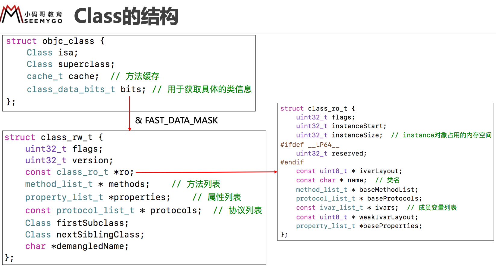
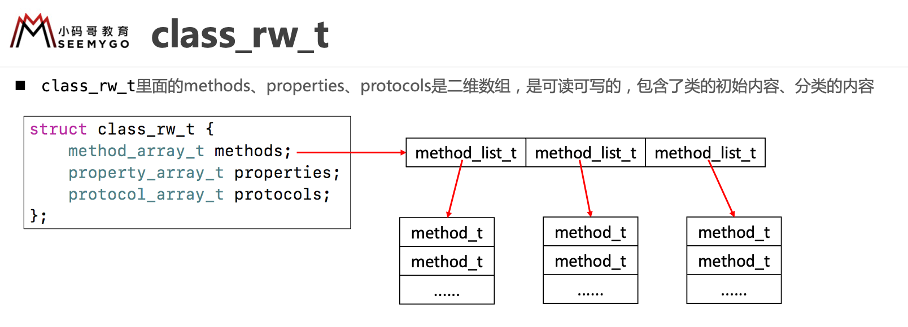
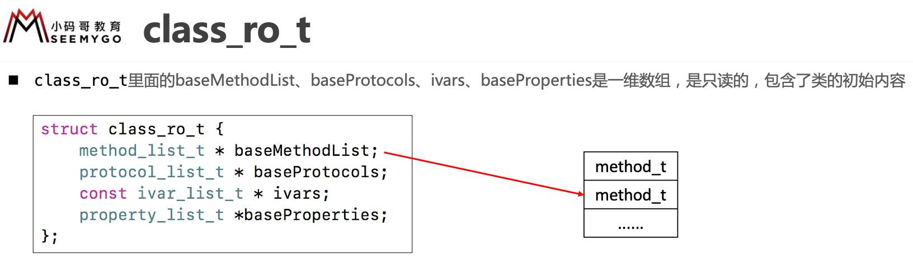
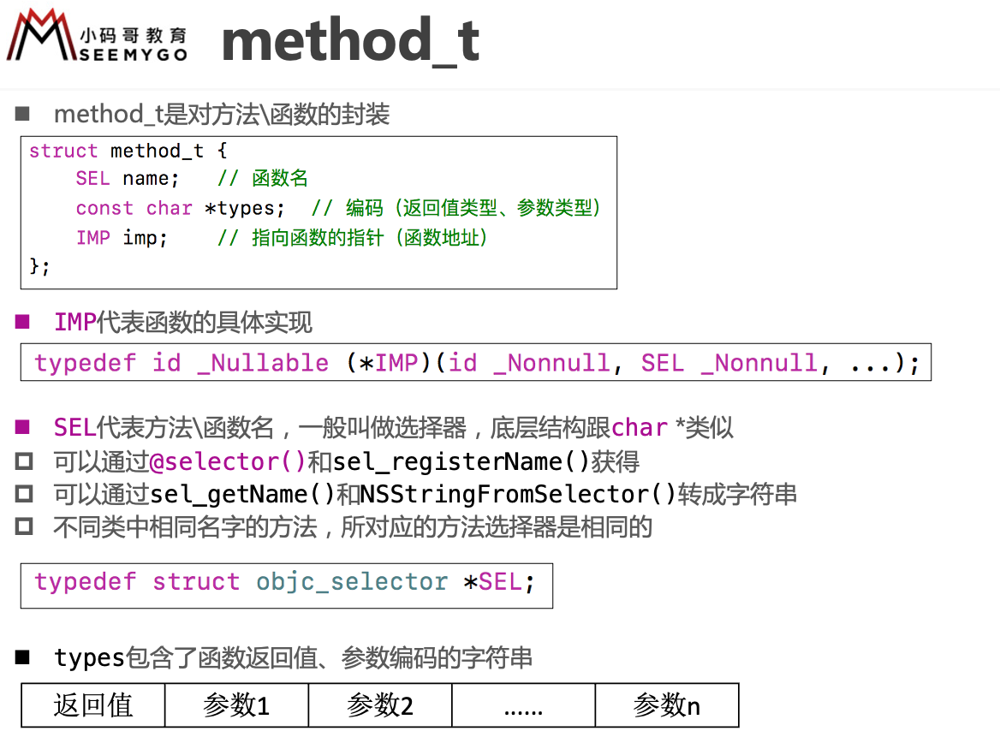
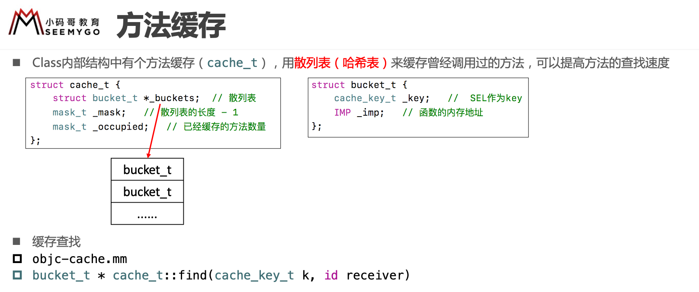
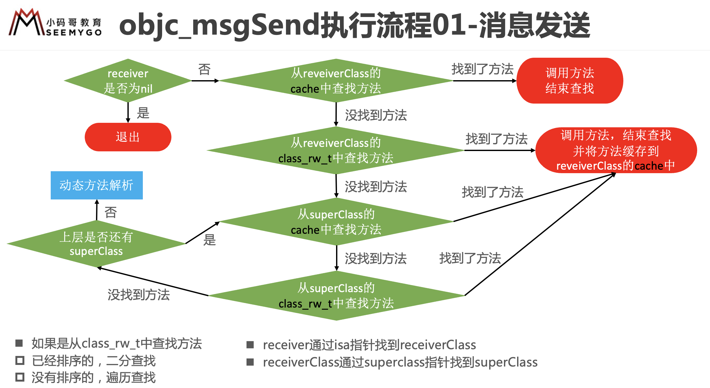
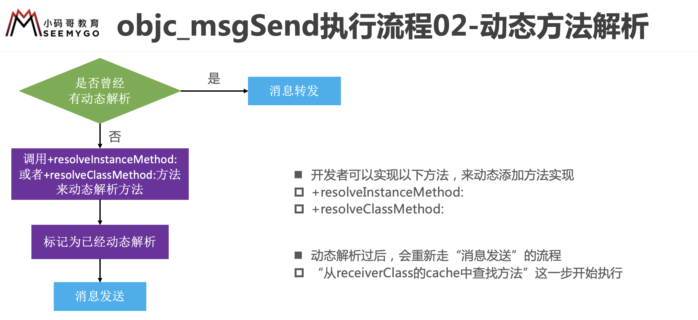
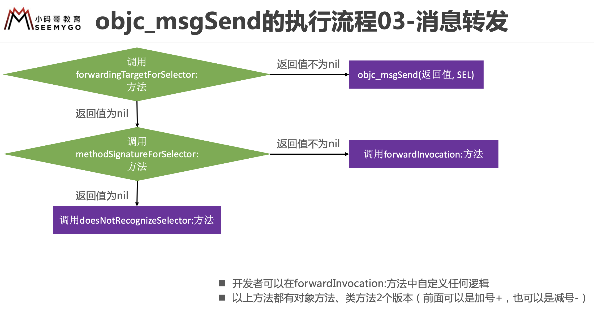

# 1. isa

要想学习Runtime，首先要了解它底层的一些常用数据结构，比如isa指针

在arm64架构之前，isa就是一个普通的指针，存储着Class、Meta-Class对象的内存地址

从arm64架构开始，对isa进行了优化，变成了一个共用体（union）结构，还使用**位域**来存储更多的信息

82264567

``` c
struct objc_object {
private:
    char isa_storage[sizeof(isa_t)];

    isa_t &isa() { return *reinterpret_cast<isa_t *>(isa_storage); }
    const isa_t &isa() const { return *reinterpret_cast<const isa_t *>(isa_storage); }
```


isa_t 类型，是一个共用体

``` c
// 共用体
union isa_t {
    isa_t() { }
    isa_t(uintptr_t value) : bits(value) { }

    uintptr_t bits;

private:
    // Accessing the class requires custom ptrauth operations, so
    // force clients to go through setClass/getClass by making this
    // private.
    Class cls;

public:
#if defined(ISA_BITFIELD)
    struct {
        ISA_BITFIELD;  // defined in isa.h
    };

    bool isDeallocating() {
        return extra_rc == 0 && has_sidetable_rc == 0;
    }
    void setDeallocating() {
        extra_rc = 0;
        has_sidetable_rc = 0;
    }
#endif

    void setClass(Class cls, objc_object *obj);
    Class getClass(bool authenticated);
    Class getDecodedClass(bool authenticated);
};

```


ISA_BITFIELD 由宏定义

``` c
#     define ISA_MASK        0x0000000ffffffff8ULL
#     define ISA_MAGIC_MASK  0x000003f000000001ULL
#     define ISA_MAGIC_VALUE 0x000001a000000001ULL
#     define ISA_HAS_CXX_DTOR_BIT 1
#     define ISA_BITFIELD                                                      \
        uintptr_t nonpointer        : 1;                                       \
        uintptr_t has_assoc         : 1;                                       \
        uintptr_t has_cxx_dtor      : 1;                                       \
		// 存放Class、Meta-Class对象的内存地址信息
		// 以前说的实例对象获取对应的类对象，需要 isa & ISA_MASK，就是获取 shiftcls 的数据
        uintptr_t shiftcls          : 33; /*MACH_VM_MAX_ADDRESS 0x1000000000*/ \
        uintptr_t magic             : 6;                                       \
        uintptr_t weakly_referenced : 1;                                       \
        uintptr_t unused            : 1;                                       \
        uintptr_t has_sidetable_rc  : 1;                                       \
        uintptr_t extra_rc          : 19
#     define ISA_HAS_INLINE_RC    1
#     define RC_HAS_SIDETABLE_BIT 44
#     define RC_ONE_BIT           (RC_HAS_SIDETABLE_BIT+1)
#     define RC_ONE               (1ULL<<RC_ONE_BIT)
#     define RC_HALF              (1ULL<<18)
```


### 掩码

掩码，一般用来按位与(&)运算的

``` c
#define MJTallMask (1<<0)
#define MJRichMask (1<<1)
#define MJHandsomeMask (1<<2)
```

``` objc
- (void)setTall:(BOOL)tall {
    if (tall) {
        _tallRichHansome |= MJTallMask; // 将某一位置1，或运算
    } else {
        // ~ : 按位取反
        _tallRichHansome &= ~MJTallMask; // 将某一位置0，掩码取反，再进行与操作
    }
}

- (BOOL)isTall {
    return !!(_tallRichHansome & MJTallMask); // 获取某一位的值，并转为YES/NO
}
```


### 位域

``` c
struct {
    char tall : 1; // : 1 代表只占一位
};
```


### 共用体

``` c
union {
    char bits;
    struct { // 利用结构体来增加可读性
        char tall : 1;
        char rich : 1;
        char handsome : 1;
    };
} _tallRichHandsome;
```


``` objc
- (void)setTall:(BOOL)tall
{
    if (tall) {
        _tallRichHandsome.bits |= MJTallMask;
    } else {
        _tallRichHandsome.bits &= ~MJTallMask;
    }
}

- (BOOL)isTall
{
    return !!(_tallRichHandsome.bits & MJTallMask);
}

```


# 2. 方法











# objc_msgSend

OC中的方法调用，其实都是转换为objc_msgSend函数的调用

objc_msgSend的执行流程可以分为3大阶段：

- 消息发送
- 动态方法解析
- 消息转发

``` assembly
	MSG_ENTRY _objc_msgSend
	UNWIND _objc_msgSend, NoFrame

	cmp	p0, #0			// nil check and tagged pointer check 判断消息接收者是否为nil
#if SUPPORT_TAGGED_POINTERS
	b.le	LNilOrTagged		//  (MSB tagged pointer looks negative)
#else
	b.eq	LReturnZero
#endif
	ldr	p14, [x0]		// p14 = raw isa
	GetClassFromIsa_p16 p14, 1, x0	// p16 = class
LGetIsaDone:
	// calls imp or objc_msgSend_uncached
	CacheLookup NORMAL, _objc_msgSend, __objc_msgSend_uncached

#if SUPPORT_TAGGED_POINTERS
LNilOrTagged:
	b.eq	LReturnZero		// nil check
	GetTaggedClass
	b	LGetIsaDone
// SUPPORT_TAGGED_POINTERS
#endif

LReturnZero:
	// x0 is already zero
	mov	x1, #0
	movi	d0, #0
	movi	d1, #0
	movi	d2, #0
	movi	d3, #0
	ret

	END_ENTRY _objc_msgSend
```


``` assembly
# macro 表示宏
.macro MSG_ENTRY /*name*/
	.text
	.align 10
	.globl    $0
$0:
.endmacro
```


# objc_msgSend执行流程

## 1. 消息发送



## 2. 动态方法解析



### 动态添加方法

方式1

``` objc
void other(id self, SEL _cmd) {
    NSLog(@"%@-%s-%s", self, sel_getName(_cmd), __func__);
}

+ (BOOL)resolveInstanceMethod:(SEL)sel {
    if (sel == @selector(test)) {
        class_addMethod(self, sel, (IMP)other, v@:);
        return YES; // 返回YES代表有动态添加方法
    }
    return [super resolveInstanceMethod:sel];
}
```

方式2

``` objc
- (void)other {
    
}

+ (BOOL)resolveInstanceMethod:(SEL)sel {
    if (sel == @selector(test)) {
        Method method = class_getInstanceMethod(self, @selector(other));
        class_addMethod(self, sel, method_getImplementation(method), method_getTypeEncoding(method));
        return YES;
    }
    return [super resolveInstanceMethod:sel];
}
```


## 3. 消息转发



 ``` objc
 - (id)forwardingTargetForSelector:(SEL)aSelector
 {
     if (aSelector == @selector(test)) {
         // objc_msgSend([[MJCat alloc] init], aSelector)
         return [[MJCat alloc] init];
     }
     return [super forwardingTargetForSelector:aSelector];
 }
 ```

``` objc
// 方法签名：返回值类型、参数类型
- (NSMethodSignature *)methodSignatureForSelector:(SEL)aSelector
{
    if (aSelector == @selector(test)) {
        return [NSMethodSignature signatureWithObjCTypes:"v16@0:8"];
    }
    return [super methodSignatureForSelector:aSelector];
}


// NSInvocation封装了一个方法调用，包括：方法调用者、方法名、方法参数
//    anInvocation.target 方法调用者
//    anInvocation.selector 方法名
//    [anInvocation getArgument:NULL atIndex:0]
- (void)forwardInvocation:(NSInvocation *)anInvocation
{
//    anInvocation.target = [[MJCat alloc] init];
//    [anInvocation invoke];
    [anInvocation invokeWithTarget:[[MJCat alloc] init]];
}
```


# @dynamic

``` objc

@interface MJPerson : NSObject
@property (assign, nonatomic) int age;
@end

@implementation MJPerson
@dynamic age; // @dynamic是告诉编译器不用自动生成getter和setter的实现，等到运行时再添加方法实现
@end
```


# super 关键字

``` objc
// 打印的还是本类的类型，并不是父类的类型，因为super调用的底层为objc_msgSendSuper，它的第一个参数还是self，所以接收消息的也是self
// super的作用是告诉方法从哪里找，真正接收消息的对象还是self
[super class] 
```


# isKindOfClass 与 isMemberOfClass

``` objc

+ (BOOL)isMemberOfClass:(Class)cls {
    return self->ISA() == cls;
}

- (BOOL)isMemberOfClass:(Class)cls {
    return [self class] == cls;
}

+ (BOOL)isKindOfClass:(Class)cls {
    for (Class tcls = self->ISA(); tcls; tcls = tcls->getSuperclass()) {
        if (tcls == cls) return YES;
    }
    return NO;
}

- (BOOL)isKindOfClass:(Class)cls {
    for (Class tcls = [self class]; tcls; tcls = tcls->getSuperclass()) {
        if (tcls == cls) return YES;
    }
    return NO;
}
```

isKindOfClass: 会判断父类是否相等

isMemberOfClass: 不会判断父类是否相等

类对象调用isKindOfClass 和 isMemberOfClass 返回的都是 false，因为类对象的class是元类对象

原则：左边是实例对象，右边就是

# runtime

``` objc
/********* 类 *********/
// 动态创建一个类（参数：父类，类名，额外的内存空间）
Class objc_allocateClassPair(Class superclass, const char *name, size_t extraBytes)

// 注册一个类（要在类注册之前添加成员变量）
void objc_registerClassPair(Class cls) 

// 销毁一个类
void objc_disposeClassPair(Class cls)

// 获取isa指向的Class（传入实例对象返回类对象，传入类对象返回元类对象）
Class object_getClass(id obj)

// 设置isa指向的Class
Class object_setClass(id obj, Class cls)

// 判断一个OC对象是否为Class
BOOL object_isClass(id obj)

// 判断一个Class是否为元类
BOOL class_isMetaClass(Class cls)

// 获取父类
Class class_getSuperclass(Class cls)


/********* 成员变量 *********/
// 获取一个实例变量信息
Ivar class_getInstanceVariable(Class cls, const char *name)

// 拷贝实例变量列表（最后需要调用free释放）
Ivar *class_copyIvarList(Class cls, unsigned int *outCount)

// 设置和获取成员变量的值
void object_setIvar(id obj, Ivar ivar, id value)
id object_getIvar(id obj, Ivar ivar)

// 动态添加成员变量（已经注册的类是不能动态添加成员变量的）
BOOL class_addIvar(Class cls, const char * name, size_t size, uint8_t alignment, const char * types)

// 获取成员变量的相关信息
const char *ivar_getName(Ivar v)
const char *ivar_getTypeEncoding(Ivar v)


/********* 属性 *********/
// 获取一个属性
objc_property_t class_getProperty(Class cls, const char *name)

// 拷贝属性列表（最后需要调用free释放）
objc_property_t *class_copyPropertyList(Class cls, unsigned int *outCount)

// 动态添加属性
BOOL class_addProperty(Class cls, const char *name, const objc_property_attribute_t *attributes,
                  unsigned int attributeCount)

// 动态替换属性
void class_replaceProperty(Class cls, const char *name, const objc_property_attribute_t *attributes,
                      unsigned int attributeCount)

// 获取属性的一些信息
const char *property_getName(objc_property_t property)
const char *property_getAttributes(objc_property_t property)


/********* 方法 *********/
// 获得一个实例方法、类方法
Method class_getInstanceMethod(Class cls, SEL name)
Method class_getClassMethod(Class cls, SEL name)

// 方法实现相关操作
IMP class_getMethodImplementation(Class cls, SEL name) 
IMP method_setImplementation(Method m, IMP imp)
void method_exchangeImplementations(Method m1, Method m2) 

// 拷贝方法列表（最后需要调用free释放）
Method *class_copyMethodList(Class cls, unsigned int *outCount)

// 动态添加方法
BOOL class_addMethod(Class cls, SEL name, IMP imp, const char *types)

// 动态替换方法
IMP class_replaceMethod(Class cls, SEL name, IMP imp, const char *types)

// 获取方法的相关信息（带有copy的需要调用free去释放）
SEL method_getName(Method m)
IMP method_getImplementation(Method m)
const char *method_getTypeEncoding(Method m)
unsigned int method_getNumberOfArguments(Method m)
char *method_copyReturnType(Method m)
char *method_copyArgumentType(Method m, unsigned int index)

// 选择器相关
const char *sel_getName(SEL sel)
SEL sel_registerName(const char *str)

// 用block作为方法实现
IMP imp_implementationWithBlock(id block)
id imp_getBlock(IMP anImp)
BOOL imp_removeBlock(IMP anImp)

```


# 面试题

## 什么是Runtime？平时项目中有用过么？

OC是一门动态性比较强的编程语言，允许很多操作推迟到程序运行时再进行

OC的动态性就是由Runtime来支撑和实现的，Runtime是一套C语言的API，封装了很多动态性相关的函数

平时编写的OC代码，底层都是转换成了Runtime API进行调用


## 具体应用

利用关联对象（AssociatedObject）给分类添加属性

遍历类的所有成员变量（修改textfield的占位文字颜色、字典转模型、自动归档解档）

交换方法实现（交换系统的方法）

利用消息转发机制解决方法找不到的异常问题

防止数组中添加nil崩溃，防止字典的key为nil，要注意类簇的问题

``` objc

@implementation NSMutableArray (Extension)

+ (void)load
{
    static dispatch_once_t onceToken;
    dispatch_once(&onceToken, ^{
        // 类簇：NSString、NSArray、NSDictionary，真实类型是其他类型
        Class cls = NSClassFromString(@"__NSArrayM");
        Method method1 = class_getInstanceMethod(cls, @selector(insertObject:atIndex:));
        Method method2 = class_getInstanceMethod(cls, @selector(mj_insertObject:atIndex:));
        method_exchangeImplementations(method1, method2);
    });
}

- (void)mj_insertObject:(id)anObject atIndex:(NSUInteger)index
{
    if (anObject == nil) return;
    
    [self mj_insertObject:anObject atIndex:index];
}

@end

```

``` objc

@implementation NSMutableDictionary (Extension)

+ (void)load
{
    static dispatch_once_t onceToken;
    dispatch_once(&onceToken, ^{
        Class cls = NSClassFromString(@"__NSDictionaryM");
        Method method1 = class_getInstanceMethod(cls, @selector(setObject:forKeyedSubscript:));
        Method method2 = class_getInstanceMethod(cls, @selector(mj_setObject:forKeyedSubscript:));
        method_exchangeImplementations(method1, method2);
        
        Class cls2 = NSClassFromString(@"__NSDictionaryI");
        Method method3 = class_getInstanceMethod(cls2, @selector(objectForKeyedSubscript:));
        Method method4 = class_getInstanceMethod(cls2, @selector(mj_objectForKeyedSubscript:));
        method_exchangeImplementations(method3, method4);
    });
}

- (void)mj_setObject:(id)obj forKeyedSubscript:(id<NSCopying>)key
{
    if (!key) return;
    
    [self mj_setObject:obj forKeyedSubscript:key];
}

- (id)mj_objectForKeyedSubscript:(id)key
{
    if (!key) return nil;
    
    return [self mj_objectForKeyedSubscript:key];
}

```


......
