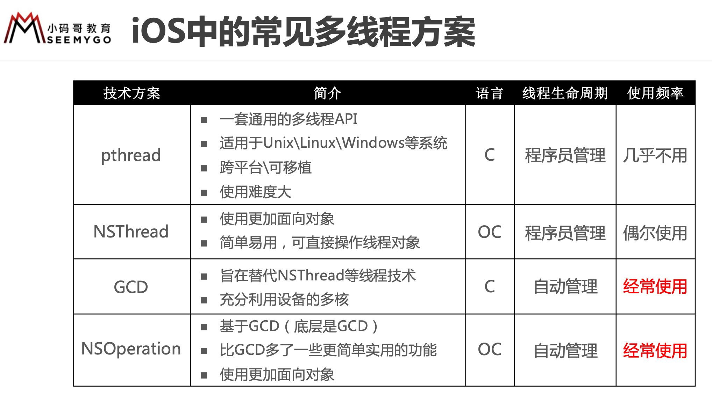

使用sync函数往当前串行队列中添加任务，会卡住当前的串行队列（产生死锁）


``` objc
// 获取主队列（串行）
dispatch_queue_t queue = dispatch_get_main_queue();
let mainQueue = DispatchQueue.main;

// 获取全局队列（并行）
dispatch_queue_t queue = dispatch_get_global_queue(0, 0);
let globalQueue = DispatchQueue.global()

// 创建串行队列 serial：连续的
dispatch_queue_t queue = dispatch_queue_create("myqueu", DISPATCH_QUEUE_SERIAL);
DispatchQueue(label: "test")
        
// 创建并行队列 concurrent：同时地
dispatch_queue_t queue2 = dispatch_queue_create("myqueu2", DISPATCH_QUEUE_CONCURRENT);
DispatchQueue(label: "test", attributes: .concurrent)

// 异步执行
dispatch_async(queue, ^{
    
});
DispatchQueue.global().async {
            
}
// 同步执行
dispatch_sync(queue2, ^{
	
});
DispatchQueue.global().sync {

}

```


# 多线程安全隐患的解决方案

解决方案：使用线程同步技术（同步，就是协同步调，按预定的先后次序进行）

常见的线程同步技术是：加锁


## OSSpinLock（不用）

spin: 旋转

- OSSpinLock叫做”自旋锁”，等待锁的线程会处于忙等（busy-wait）状态，一直占用着CPU资源
- 目前已经不再安全，可能会出现优先级反转问题
- 如果等待锁的线程优先级较高，它会一直占用着CPU资源，优先级低的线程就无法释放锁
- 需要导入头文件#import <libkern/OSAtomic.h>


``` objc
@property (assign, nonatomic) OSSpinLock lock;

// 初始化锁
self.lock = OS_SPINLOCK_INIT;

// 加锁
OSSpinLockLock(&_lock);
oldTicketsCount--;
// 解锁
OSSpinLockUnlock(&_lock);
```


## os_unfair_lock（不用）
- os_unfair_lock用于取代不安全的OSSpinLock ，从iOS10开始才支持
- 从底层调用看，等待os_unfair_lock锁的线程会处于休眠状态，并非忙等
- 需要导入头文件#import <os/lock.h>

``` objc
@property (assign, nonatomic) os_unfair_lock moneyLock;

self.moneyLock = OS_UNFAIR_LOCK_INIT;

os_unfair_lock_lock(&_ticketLock);
[super __saleTicket];
os_unfair_lock_unlock(&_ticketLock);
```


## pthread_mutex 互斥锁
- mutex叫做”互斥锁”，等待锁的线程会处于休眠状态
- 需要导入头文件#import <pthread.h>

``` objc
@property (assign, nonatomic) pthread_mutex_t ticketMutex;
pthread_mutex_init(&ticketMutex, NULL);

pthread_mutex_lock(&_ticketMutex);
[super __saleTicket];
pthread_mutex_unlock(&_ticketMutex);

- (void)dealloc {
    pthread_mutex_destroy(&_ticketMutex);
}
```

递归锁

``` objc

@property (assign, nonatomic) pthread_mutex_t mutex;

- (void)__initMutex:(pthread_mutex_t *)mutex
{
    // 递归锁：允许同一个线程对一把锁进行重复加锁
    
    // 初始化属性
    pthread_mutexattr_t attr;
    pthread_mutexattr_init(&attr);
    pthread_mutexattr_settype(&attr, PTHREAD_MUTEX_RECURSIVE);
    // 初始化锁
    pthread_mutex_init(mutex, &attr);
    // 销毁属性
    pthread_mutexattr_destroy(&attr);
}

[self __initMutex:&_mutex];


- (void)otherTest
{
    pthread_mutex_lock(&_mutex);
    
    NSLog(@"%s", __func__);
    
    static int count = 0;
    if (count < 10) {
        count++;
        [self otherTest];
    }
    
    pthread_mutex_unlock(&_mutex);
}

```


## NSCondition 条件锁

condition: 条件

生产者-消费者模式

对pthread_mutex的封装

方法

``` objc
//一般用于多线程同时访问、修改同一个数据源，保证在同一时间内数据源只被访问、修改一次，其他线程的命令需要在lock 外等待，只到unlock ，才可访问
[condition lock];

//与lock 同时使用
[condition unlock];

//让当前线程处于等待状态
[condition wait];

//CPU发信号告诉线程不用在等待，可以继续执行
[condition signal];
```

示例

``` objc

@interface ViewController ()

@property (nonatomic, strong) NSCondition *condition;
@property (nonatomic, strong) NSMutableArray *collector;

@end

@implementation ViewController

- (void)viewDidLoad {
    [super viewDidLoad];
    // Do any additional setup after loading the view.
    
    self.condition = [[NSCondition alloc] init];
    self.collector = [[NSMutableArray alloc] initWithCapacity:0];
    
    [self test];
}

- (void)test {
    __weak typeof(self) weakSelf = self;
    dispatch_async(dispatch_get_global_queue(0, DISPATCH_QUEUE_PRIORITY_DEFAULT), ^{
        while (true) {
            [weakSelf.condition lock];
            if (weakSelf.collector.count > 0 ) {
                [weakSelf.condition wait];
            }
            [weakSelf.collector addObject:@"商品"];
            NSLog(@"生产:商品");
            [weakSelf.condition signal];
            [weakSelf.condition unlock];
        }
    });
    
    dispatch_async(dispatch_get_global_queue(0, DISPATCH_QUEUE_PRIORITY_DEFAULT), ^{
        while (true) {
            [weakSelf.condition lock];
            if (weakSelf.collector.count == 0 ) {
                [weakSelf.condition wait];
            }
            
            NSString *item = [weakSelf.collector objectAtIndex:0];
            NSLog(@"消费:%@",item);
            [weakSelf.collector removeObjectAtIndex:0];
            [weakSelf.condition signal];
            [weakSelf.condition unlock];
        }
    });
}

@end
    
/**
解析
当collector.count == 0时, 消费线程condition调用wait进入等待状态。生产线程生产商品后condition调用signal，释放信号，使处于等待的消费线程唤醒。这时collector.count > 0，生产线程condition调用wait进入等待状态。消费线程消费商品后调用signal，释放信号，使生产线程唤醒开始生产...，从而不断生产、消费、生产、消费的流程。
*/
```


## NSConditionLock 条件锁

condition: 条件

可以解决串行调用的多个网络请求

NSConditionLock是对NSCondition的进一步封装，可以设置具体的条件值

``` objc
NSConditionLock *conditionLock = [[NSConditionLock alloc] initWithCondition:2];
dispatch_async(dispatch_get_global_queue(DISPATCH_QUEUE_PRIORITY_HIGH, 0), ^{
   [conditionLock lockWhenCondition:1];
   NSLog(@"线程1");
   [conditionLock unlockWithCondition:0];
});
dispatch_async(dispatch_get_global_queue(DISPATCH_QUEUE_PRIORITY_LOW, 0), ^{
   [conditionLock lockWhenCondition:2];
   NSLog(@"线程2");
   [conditionLock unlockWithCondition:1];
});
dispatch_async(dispatch_get_global_queue(0, 0), ^{
   [conditionLock lock];
   NSLog(@"线程3");
   [conditionLock unlock];
});

/**
解析：

线程1调用[NSConditionLock lockWhenCondition:]，此时此刻因为不满足当前条件，所以会进入等待状态。此时当前的线程3调用[NSConditionLock lock:]，本质上是调用 [NSConditionLock lockBeforeDate:]，这里不需要比对条件值，所以线程 3会打印。接下来线程2执行[NSConditionLock lockWhenCondition:]，因为满足条件值，所以线程2会打印，打印完成后会调用[NSConditionLock unlockWithCondition:],这个时候将条件设置为 1，并发送boradcast, 此时线程1接收到当前的信号，唤醒执行并打印。
自此当前打印为 线程 3->线程 2 -> 线程 1。
[NSConditionLock lockWhenCondition:]:这里会根据传入的condition 值和value值进行对比，如果不相等，这里就会阻塞。而[NSConditionLock unlockWithCondition:]会先更改当前的value值，然后调用boradcast，唤醒当前的线程。

*/
```


## dispatch_semaphore 信号量

可以解决最大并发量

设置value为1，可以解决多个弹窗问题

- dispatch_semaphore_create
- dispatch_semaphore_wait -1
- dispatch_semaphore_signal +1

``` objc

@interface SemaphoreDemo()
@property (strong, nonatomic) dispatch_semaphore_t semaphore;
@end

@implementation SemaphoreDemo

- (instancetype)init
{
    if (self = [super init]) {
        self.semaphore = dispatch_semaphore_create(5);
    }
    return self;
}

- (void)otherTest
{
    for (int i = 0; i < 20; i++) {
        [[[NSThread alloc] initWithTarget:self selector:@selector(test) object:nil] start];
    }
}

- (void)test
{
    // 如果信号量的值 > 0，就让信号量的值减1，然后继续往下执行代码
    // 如果信号量的值 <= 0，就会休眠等待，直到信号量的值变成>0，就让信号量的值减1，然后继续往下执行代码
    dispatch_semaphore_wait(self.semaphore, DISPATCH_TIME_FOREVER);
    
    sleep(2);
    NSLog(@"test - %@", [NSThread currentThread]);
    
    // 让信号量的值+1 signal:信号
    dispatch_semaphore_signal(self.semaphore);
}

@end

```


## atomic
- atomic用于保证属性setter、getter的原子性操作，相当于在getter和setter内部加了线程同步的锁
- 可以参考源码objc4的objc-accessors.mm
- 它并不能保证使用属性的过程是线程安全的


## 读写锁
- 同一时间，只能有1个线程进行写的操作
- 同一时间，允许有多个线程进行读的操作
- 同一时间，不允许既有写的操作，又有读的操作


上面的场景就是典型的“多读单写”，经常用于文件等数据的读写操作，iOS中的实现方案有
- pthread_rwlock：读写锁
- dispatch_barrier_async：异步栅栏调用

``` objc

@interface ViewController ()
@property (assign, nonatomic) pthread_rwlock_t lock;
@end

@implementation ViewController

- (void)viewDidLoad {
    [super viewDidLoad];
    
    // 初始化锁
    pthread_rwlock_init(&_lock, NULL);
    
    dispatch_queue_t queue = dispatch_get_global_queue(0, 0);
    
    for (int i = 0; i < 10; i++) {
        dispatch_async(queue, ^{
            [self read];
        });
        dispatch_async(queue, ^{
            [self write];
        });
    }
}


- (void)read {
    pthread_rwlock_rdlock(&_lock);
    
    sleep(1);
    NSLog(@"%s", __func__);
    
    pthread_rwlock_unlock(&_lock);
}

- (void)write {
    pthread_rwlock_wrlock(&_lock);
    
    sleep(1);
    NSLog(@"%s", __func__);
    
    pthread_rwlock_unlock(&_lock);
}

- (void)dealloc {
    pthread_rwlock_destroy(&_lock);
}

@end
```


dispatch_barrier_async

- 这个函数传入的并发队列必须是自己通过dispatch_queue_cretate创建的

- 如果传入的是一个串行或是一个全局的并发队列，那这个函数便等同于dispatch_async函数的效果

``` objc
@property (strong, nonatomic) dispatch_queue_t queue;

self.queue = dispatch_queue_create("rw_queue", DISPATCH_QUEUE_CONCURRENT);

dispatch_async(self.queue, ^{
	[self read];
});
        
dispatch_barrier_async(self.queue, ^{
	[self write];
});
```


# dispatch_group

可以获取多个网络请求全部完成时的回调

``` objc
// 全局变量group  
group = dispatch_group_create();  
// 并行队列  
dispatch_queue_t queue = dispatch_get_global_queue(DISPATCH_QUEUE_PRIORITY_DEFAULT, 0);  

// 进入组（进入组和离开组必须成对出现, 否则会造成死锁）  
dispatch_group_enter(group);  // 如果是异步任务才需要加 enter leave
dispatch_group_async(group, queue, ^{  
    // 执行异步任务1  
    [self fetchBaseData];  
});  

// 进入组  
dispatch_group_enter(group);  
dispatch_group_async(group, queue, ^{  
    // 执行异步任务2  
    [self fetchInspectorBaseData];  
});  

dispatch_group_notify(group, dispatch_get_main_queue(), ^{  
    [SVProgressHUD dismiss];  
    ILog(@"全部基础数据下载完毕!");  
    [[AppDelegate sharedDelegate] showMainView];  
});  
  
#pragma mark - 获取基础数据  
- (void)fetchBaseData  
{  
    // 执行异步操作
	dispatch_group_leave(group);  
}  
  
#pragma mark - 获取巡查基础数据  
- (void)fetchInspectorBaseData  
{  
	// 执行异步操作
	dispatch_group_leave(group);  
}  
```


# 栅栏函数

``` objc
dispatch_queue_t queue = dispatch_queue_create("Felix", DISPATCH_QUEUE_CONCURRENT);
    
NSLog(@"开始——%@", [NSThread currentThread]);
dispatch_async(queue, ^{
    sleep(2);
    NSLog(@"延迟2s的任务1——%@", [NSThread currentThread]);
});
NSLog(@"第一次结束——%@", [NSThread currentThread]);
// barrier：障碍物
dispatch_barrier_async(queue, ^{
    NSLog(@"----------栅栏任务----------%@", [NSThread currentThread]);
});
NSLog(@"栅栏结束——%@", [NSThread currentThread]);

dispatch_async(queue, ^{
    sleep(1);
    NSLog(@"延迟1s的任务2——%@", [NSThread currentThread]);
});
NSLog(@"第二次结束——%@", [NSThread currentThread]);

/*
开始——<NSThread: 0x600000820bc0>{number = 1, name = main}
第一次结束——<NSThread: 0x600000820bc0>{number = 1, name = main}
栅栏结束——<NSThread: 0x600000820bc0>{number = 1, name = main}
第二次结束——<NSThread: 0x600000820bc0>{number = 1, name = main}
延迟2s的任务1——<NSThread: 0x600000863c80>{number = 4, name = (null)} // 如果没有使用栅栏函数会先执行 延迟1s的任务2
----------栅栏任务----------<NSThread: 0x600000863c80>{number = 4, name = (null)}
延迟1s的任务2——<NSThread: 0x600000863c80>{number = 4, name = (null)}
*/
```


# NSOperation

- 抽象类
- 依赖于子类`NSInvocationOperation`、`NSBlockOperation`去实现

## NSInvocationOperation

invocation: 祈求

operation： 操作

``` objc
- (void)test {
    // 处理事务
    NSInvocationOperation *op = [[NSInvocationOperation alloc] initWithTarget:self
    selector:@selector(handleInvocation:) object:@"Felix"];
    // 创建队列
    NSOperationQueue *queue = [[NSOperationQueue alloc] init];
    // 操作加入队列
    [queue addOperation:op];
}

- (void)handleInvocation:(id)operation {
    NSLog(@"%@ --- %@",op, [NSThread currentThread]);
}
--------------------输出结果：-------------------
Felix --- <NSThread: 0x6000000422c0>{number = 3, name = (null)}
--------------------输出结果：-------------------
```

- 直接处理事务，不添加隐性队列

``` objc
- (void)test {
    NSInvocationOperation *op = [[NSInvocationOperation alloc] initWithTarget:self selector:@selector(handleInvocation:) object:@"Felix"];
    [op start]; // 添加到队列不能调用start
}
```

## NSBlockOperation

``` objc
- (void)test {
    // 初始化添加事务
    NSBlockOperation *bo = [NSBlockOperation blockOperationWithBlock:^{
        NSLog(@"任务1————%@",[NSThread currentThread]);
    }];
    // 添加事务
    [bo addExecutionBlock:^{
        NSLog(@"任务2————%@",[NSThread currentThread]);
    }];
    // 回调监听
    bo.completionBlock = ^{
        NSLog(@"完成了!!!");
    };
    
    // NSOperationQueue是异步执行的，所以任务一、任务二的完成顺序不确定
    NSOperationQueue *queue = [[NSOperationQueue alloc] init];

    [queue addOperation:bo];
    NSLog(@"事务添加进了NSOperationQueue");
}

--------------------输出结果：-------------------
事务添加进了NSOperationQueue
任务1————<NSThread: 0x6000032dc1c0>{number = 5, name = (null)}
任务2————<NSThread: 0x6000032a1880>{number = 4, name = (null)}
完成了!!!
--------------------输出结果：-------------------
```

## 设置优先级

``` objc
// 设置最高优先级
bo.qualityOfService = NSQualityOfServiceUserInteractive; // NSQualityOfServiceBackground
```

## 线程间通讯

``` objc
NSOperationQueue *queue = [[NSOperationQueue alloc] init];
queue.name = @"Felix";
[queue addOperationWithBlock:^{
    NSLog(@"请求网络%@--%@", [NSOperationQueue currentQueue], [NSThread currentThread]);
    [[NSOperationQueue mainQueue] addOperationWithBlock:^{
        NSLog(@"刷新UI%@--%@", [NSOperationQueue currentQueue], [NSThread currentThread]);
    }];
}];
```

## maxConcurrentOperationCount

在`GCD`中只能使用信号量来设置并发数

## 添加依赖

addDependency

``` objc
- (void)test {
    NSOperationQueue *queue = [[NSOperationQueue alloc] init];
    NSBlockOperation *bo1 = [NSBlockOperation blockOperationWithBlock:^{
        [NSThread sleepForTimeInterval:0.5];
        NSLog(@"请求token");
    }];
    
    NSBlockOperation *bo2 = [NSBlockOperation blockOperationWithBlock:^{
        [NSThread sleepForTimeInterval:0.5];
        NSLog(@"拿着token,请求数据1");
    }];
    
    NSBlockOperation *bo3 = [NSBlockOperation blockOperationWithBlock:^{
        [NSThread sleepForTimeInterval:0.5];
        NSLog(@"拿着数据1,请求数据2");
    }];
    
    [bo2 addDependency:bo1];
    [bo3 addDependency:bo2];
    
    [self.queue addOperations:@[bo1,bo2,bo3] waitUntilFinished:YES];
    
    NSLog(@"执行完了?我要干其他事");
}

--------------------输出结果：-------------------
请求token
拿着token,请求数据1
拿着数据1,请求数据2
执行完了?我要干其他事
--------------------输出结果：-------------------
```

## 任务的挂起、继续、取消

``` objc
// 挂起
queue.suspended = YES;
// 继续
queue.suspended = NO;
// 取消
[queue cancelAllOperations];
```

## 项目中的使用

SDWebImage 的底层实现

``` objc
UIImage *cacheImage = self.imageCacheDict[model.imageUrl];
if (cacheImage) {
    NSLog(@"从内存获取图片:%@", model.title);
    cell.imageView.image = cacheImage;
    return cell;
}

UIImage *diskImage = [UIImage imageWithContentsOfFile:[model.imageUrl getDowloadImagePath]];
if (diskImage) {
    NSLog(@"从沙盒获取image:%@",model.title);
    cell.imageView.image = diskImage;
    [self.imageCacheDict setValue:diskImage forKey:model.imageUrl];
    return cell;
}

NSBlockOperation *bo = [NSBlockOperation blockOperationWithBlock:^{
    NSLog(@"去下载图片:%@", model.title);
    // 延迟
    NSData *data   = [NSData dataWithContentsOfURL:imageURL];
    UIImage *image = [UIImage imageWithData:data];
    // 存内存
    [self.imageCacheDict setValue:image forKey:model.imageUrl];
    [data writeToFile:[model.imageUrl getDowloadImagePath] atomically:YES];

    // 更新UI
    [[NSOperationQueue mainQueue] addOperationWithBlock:^{
        cell.imageView.image = image;
    }];
}];

[self.queue addOperation:bo];
return cell;
```


# 面试题

``` objc

- (void)test2 {
    dispatch_queue_t queue = dispatch_get_global_queue(0, 0);
    dispatch_async(queue, ^{
        NSLog(@"1");
        // 这句代码的本质是往Runloop中添加定时器，子线程默认没有runloop perform：执行
        [self performSelector:@selector(test) withObject:nil afterDelay:.0];
        NSLog(@"3");
        
        //        [[NSRunLoop currentRunLoop] addPort:[[NSPort alloc] init] forMode:NSDefaultRunLoopMode];
        [[NSRunLoop currentRunLoop] runMode:NSDefaultRunLoopMode beforeDate:[NSDate distantFuture]];
    });
}

- (void)test {
    NSLog(@"2");
}

// 1 3
```


``` objc
NSThread *thread = [[NSThread alloc] initWithBlock:^{
    NSLog(@"1");
    
    // 不加下面的代码，在执行performSelector时会崩溃，因为线程在执行完block后就已经销毁
    [[NSRunLoop currentRunLoop] addPort:[[NSPort alloc] init] forMode:NSDefaultRunLoopMode];
    [[NSRunLoop currentRunLoop] runMode:NSDefaultRunLoopMode beforeDate:[NSDate distantFuture]];
}];
[thread start];

[self performSelector:@selector(test) onThread:thread withObject:nil waitUntilDone:YES];
```


异步并发执行任务1、任务2

等任务1、任务2都执行完毕后，再回到主线程执行任务3

``` objc
    // 创建队列组
    dispatch_group_t group = dispatch_group_create();
    // 创建并发队列
    dispatch_queue_t queue = dispatch_queue_create("my_queue", DISPATCH_QUEUE_CONCURRENT);
    
    // 添加异步任务
    dispatch_group_async(group, queue, ^{
        for (int i = 0; i < 5; i++) {
            NSLog(@"任务1-%@", [NSThread currentThread]);
        }
    });
    
    dispatch_group_async(group, queue, ^{
        for (int i = 0; i < 5; i++) {
            NSLog(@"任务2-%@", [NSThread currentThread]);
        }
    });
    
    dispatch_group_notify(group, queue, ^{
        for (int i = 0; i < 5; i++) {
            NSLog(@"任务3-%@", [NSThread currentThread]);
        }
    });
```

