# 1. 一个NSObject对象占用多少内存？

### NSObject 的底层实现

一个C的结构体，有一个Class类型的成员变量isa

``` objc
// NSObject 的定义
@interface NSObject <NSObject> {
    Class isa;
}

// NSObject 的底层实现
struct NSObject_IMPL {
	Class isa; // 指针：8个字节
};

typedef struct objc_class *Class;
```


### 打印类所占用内存空间的大小

``` objc
NSObject *objc = [[NSObject alloc] init];
// 创建一个实例对象，需要多少内存
NSLog(@"%zd", class_getInstanceSize([NSObject class])); // 8
// 创建一个实例对象，实际分配的内存空间
NSLog(@"%zd", malloc_size((__bridge const void *)objc)); // 16
```

OC源码地址：https://github.com/apple-oss-distributions/objc4/tags


系统会分配16（malloc_size获取）个字节，但是实际使用只有8（class_getInstanceSize获取）个字节，这8个字节存放的是isa的指针。

### 系统为什么会分配16个字节？

CoreFundation 要求所有对象至少为 16 个字节。 

``` c++
inline size_t instanceSize(size_t extraBytes) const {
    if (fastpath(cache.hasFastInstanceSize(extraBytes))) {
        return cache.fastInstanceSize(extraBytes);
    }

    size_t size = alignedInstanceSize() + extraBytes;
    // CF requires all objects be at least 16 bytes.
    // CF 要求所有对象至少为 16 个字节。
    if (size < 16) size = 16;
    return size;
}
```


- OC代码，底层实现其实都是C/C++代码
- OC面向对象都是基于C/C++的数据结构实现的
- OC的对象、类主要是基于C/C++的结构体实现的


### 将OC转为C++

``` shell
# 将OC转为C++
$ clang -rewrite-objc main.m -o main.cpp

# 将OC转为C++，并指定架构
$ xcrun -sdk iphoneos clang -arch arm64 -rewrite-objc main.m -o main.cpp

# 在使用clang转换OC为C++代码时，可能会遇到以下问题
# cannot create __weak reference in file using manual reference
# 解决方案：支持ARC、指定运行时系统版本，比如
$ xcrun -sdk iphoneos clang -arch arm64 -rewrite-objc -fobjc-arc -fobjc-runtime=ios-8.0.0 main.m

```


### 继承NSObject的类占用的内存空间

第一个成员变量为isa，子类中定义的成员变量依次向后排列

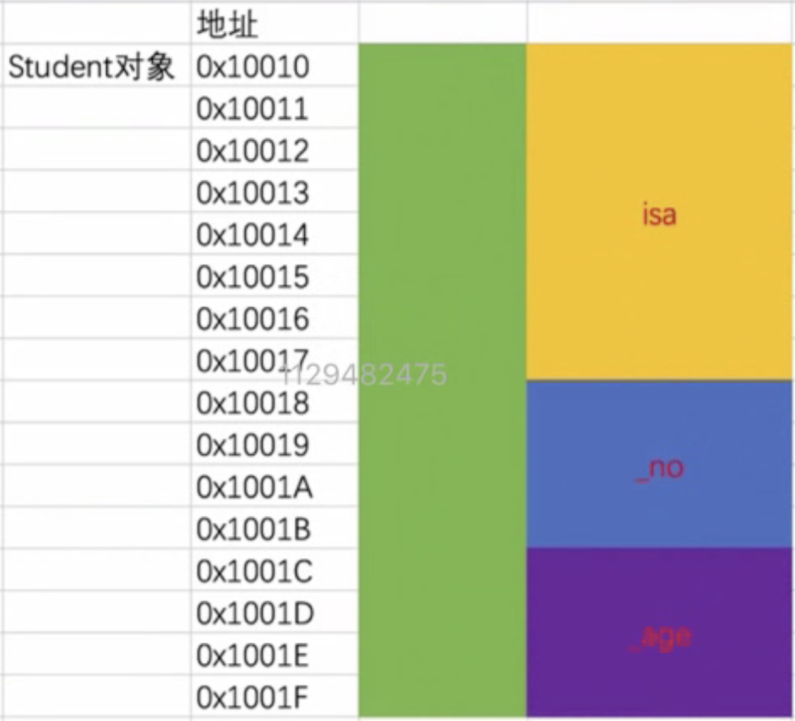

``` objc

//struct NSObject_IMPL {
//    Class isa;
//};
//

struct Student_IMPL {
    Class isa;
    int _no;
    int _age;
};


@interface Student : NSObject
{
    @public
    int _no;
    int _age;
}
@end

@implementation Student

@end

int main(int argc, const char * argv[]) {
    @autoreleasepool {
        Student *stu = [[Student alloc] init];
        stu->_no = 4;
        stu->_age = 5;
        
        NSLog(@"%zd", class_getInstanceSize([Student class])); // 16
        NSLog(@"%zd", malloc_size((__bridge const void *)stu)); // 16 如果 Student再添加一个int属性，那么打印为32，为什么是32，看内存对齐
        
        struct Student_IMPL *stuImpl = (__bridge struct Student_IMPL *)stu;
        NSLog(@"no is %d, age is %d", stuImpl->_no, stuImpl->_age);
    }
    return 0;
}

```


### 内存对齐

- 结构体内存对齐
    - 结构体的大小必须是最大成员的倍数
- 系统分配内存对齐
    - iOS系统分配堆空间默认为16的整数倍（ libmalloc 库中的 Buckets sized ）


# 2. OC类信息存放在哪里？

实例对象：成员变量的值

类对象：实例对象的方法、属性信息、成员变量信息（类型/名字）、协议信息

元类对象：类方法


## 2.1 instance对象（实例对象）

通过类对象alloc出来的对象

### 实例对象中存储哪些信息？

成员变量（isa和自定义成员变量）

``` c++
struct Student_IMPL {
    Class isa;
    int _no;
    int _age;
};
```


## 2.2 class对象（类对象）

### 类对象中存储哪些信息？

- isa指针
- superclass指针
- 类的属性信息（@property）、类的实例对象方法信息（instance method）
- 类的协议信息（protocol）、类的成员变量信息（ivar，实例对象中保存的是成员变量的值，类对象中保存的是成员变量的描述信息，比如类型/名字）


### 怎样根据 实例对象 获取 类对象？

``` objc
Student *stu = [[Student alloc] init];
// 根据实例对象获取类对象
Class objectClass1 = [stu class]; // typedef struct objc_class *Class;
Class objectClass2 = [NSObject class];
Class objectClass3 = objc_getClass(stu); // #import <objc/runtime.h>
```


## 2.3 meta-class对象（元类对象）

元类对象的类型和类对象的类型是一样的，都是Class类型

### 元类对象中存储哪些信息？

- isa指针
- superclass指针
- 类方法（class method）

### 如何获取元类对象?

``` objc
Class objectMetaClass = object_getClass(类对象);
```


# 3. 对象的isa指针指向哪里？

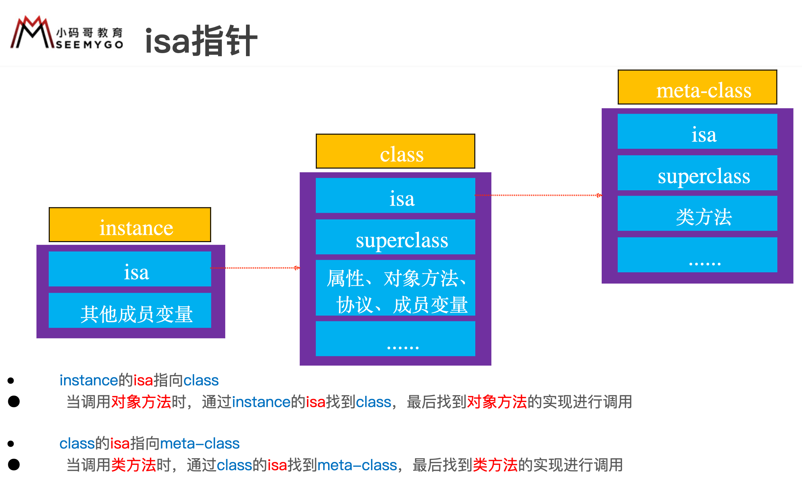

instance对象的isa指向class对象，class对象的isa指向meta-class对象，meta-class对象的isa指向基类（NSObject）的meta-class对象


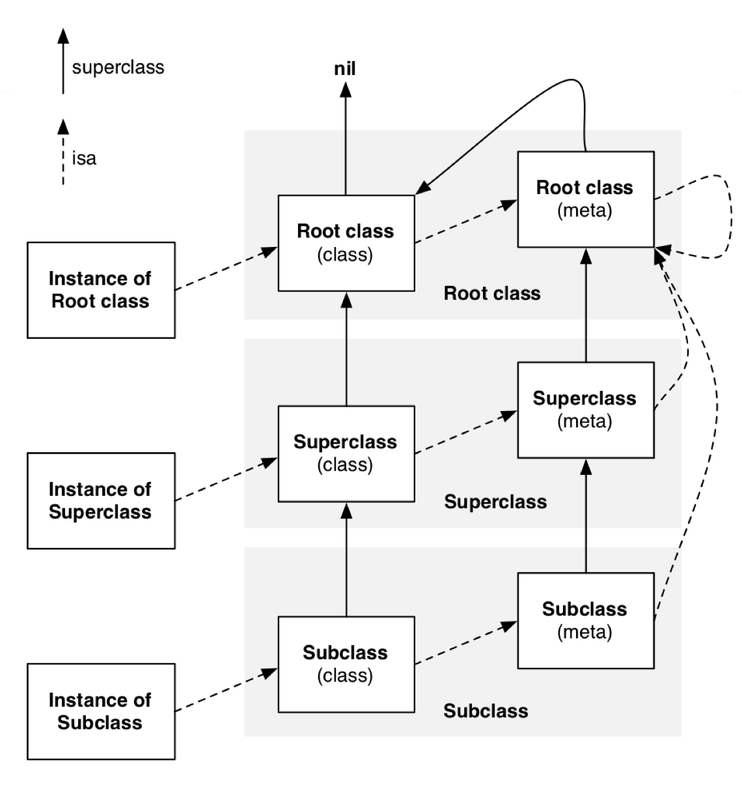


isa 需要 & ISA_MASK 才能得到真实的值


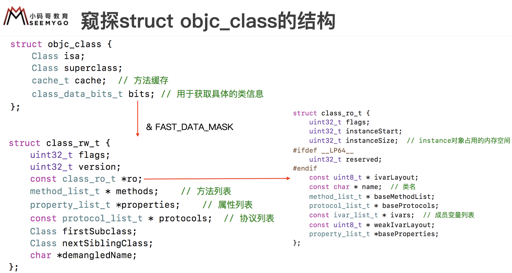

 

# 4. iOS用什么方式实现对一个对象的KVO？（KVO的本质是什么）

添加了KVO的类，runtime会动态生成一个该类的子类并重写了setter方法，直接修改成员变量并不会触发KVO，但是可以用手动触发。

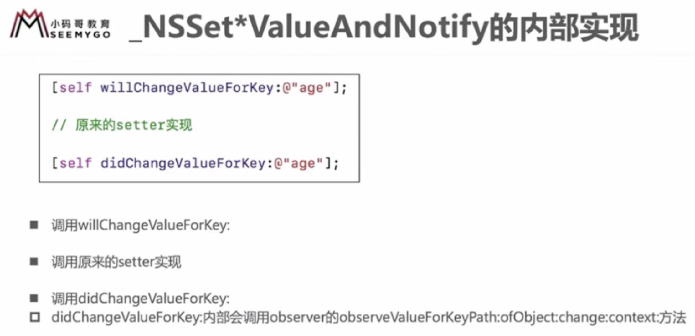

## 4.1 什么是KVO？

Key-Value Observing，俗称“键值监听”，可以用于监听某个对象属性值的改变

## 4.2 如何实现KVO

``` objc

- (void)viewDidLoad {
    [super viewDidLoad];
    
    self.person = [[MJPerson alloc] init];
    
    // 给 person 对象添加kvo监听
    NSKeyValueObservingOptions options = NSKeyValueObservingOptionNew | NSKeyValueObservingOptionOld;
    [self.person addObserver:self forKeyPath:@"age" options:options context:nil];
}

- (void)touchesBegan:(NSSet<UITouch *> *)touches withEvent:(UIEvent *)event {
    // (self.person.age = 10;) = ([self.person setAge:10];)
    self.person.age = 10;
}

// 当监听对象的属性值发生改变时，就会调用
- (void)observeValueForKeyPath:(NSString *)keyPath ofObject:(id)object change:(NSDictionary<NSKeyValueChangeKey,id> *)change context:(void *)context {
    NSLog(@"监听到 %@ 的 %@ 属性值发生改变： %@ ", object, keyPath, change);
}

- (void)dealloc {
    [self.person removeObserver:self forKeyPath:@"age"];
}

/* 打印
 监听到 <MJPerson: 0x6000023c82c0> 的 age 属性值发生改变： {
     kind = 1;
     new = 10;
     old = 0;
 }
 */
```

## 4.3 如何手动触发KVO？

``` objc
[self.person willChangeValueForKey:@"age"];
[self.person didChangeValueForKey:@"age"];
```


# 5. KVC

Key-Value Coding，俗称“键值编码”，可以通过一个key来访问某个属性

## 常用API

``` objc
// value 必须为 OC 对象
- (void)setValue:(id)value forKey:(NSString *)key;
- (id)valueForKey:(NSString *)key;
 
// keyPath 可以设置属性的属性
- (void)setValue:(id)value forKeyPath:(NSString *)keyPath;
- (id)valueForKeyPath:(NSString *)keyPath;
```


NS Number 的三种创建形式

``` objc
[self.person setValue:[NSNumber numberWithInt:1] forKey:@"age"];
[self.person setValue:@(1) forKey:@"age"];
[self.person setValue:@1 forKey:@"age"];
```


## 通过KVC修改属性会触发KVO吗？

会触发，不管有没有setter方法，都会触发，底层应该实现了手动触发

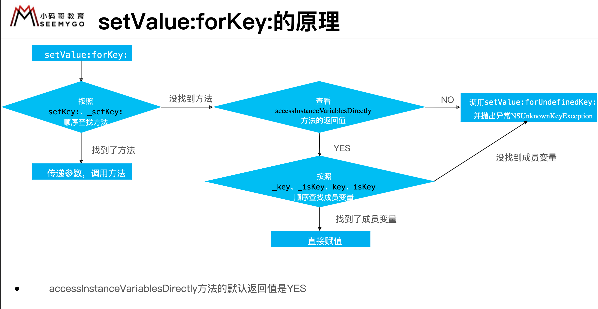


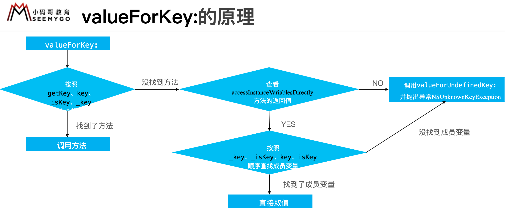


# 6. Catogory

通过runtime动态将分类的方法合并到类对象、元类对象中

分类中可以定义：对象方法，类方法，协议，属性

如果分类覆盖了类中的方法，那么调用时会先调用分类中的方法。

image：镜像/模块


## 6.1 Category能否添加成员变量？如果可以，如何给Category添加成员变量？

不能直接给Category添加成员变量，但是可以间接实现Category有成员变量的效果，定义一个全局字典，用self的地址作为key。

分类可以添加属性，但是编译后只有getter和setter方法，并没有成员变量。

``` objc
// 间接实现Category有成员变量
// 方式1: 关联对象

#import <objc/runtime.h>

@implementation MJPerson (Test)

- (void)setName:(NSString *)name
{
    objc_setAssociatedObject(self, @selector(name), name, OBJC_ASSOCIATION_COPY_NONATOMIC);
}

- (NSString *)name
{
    // 隐式参数
    // _cmd == @selector(name)
    return objc_getAssociatedObject(self, _cmd);
}

- (void)setWeight:(int)weight
{
    objc_setAssociatedObject(self, @selector(weight), @(weight), OBJC_ASSOCIATION_RETAIN_NONATOMIC);
}

- (int)weight
{
    // _cmd == @selector(weight)
    return [objc_getAssociatedObject(self, _cmd) intValue];
}

@end
```


``` objc

// 间接实现Category有成员变量
// 存在线程安全
#define MJKey [NSString stringWithFormat:@"%p", self]

@implementation MJPerson (Test)

NSMutableDictionary *names_;
NSMutableDictionary *weights_;
+ (void)load
{
    weights_ = [NSMutableDictionary dictionary];
    names_ = [NSMutableDictionary dictionary];
}

- (void)setName:(NSString *)name
{
    names_[MJKey] = name;
}

- (NSString *)name
{
    return names_[MJKey];
}

- (void)setWeight:(int)weight
{
    weights_[MJKey] = @(weight);
}

- (int)weight
{
    return [weights_[MJKey] intValue];
}

@end
```


## 6.2 +load方法

+load方法会在runtime加载类、分类时调用

runtime是在程序启动时就会运行，所有程序刚启动就会加载所有类和分类。

分类的load方法与分类的普通方法不同，是直接通过函数指针调用，而普通方法是通过objc_msgSend方法调用。

每个类、分类的+load方法，在程序运行过程中只调用一次。


# 7. +initialize

+initialize 方法会在类第一次接收到消息时调用

是通过objc_msgSend调用，所以有分类实现了+initialize方法，会调用分类中的方法。

先调用父类的+initialize，再调用子类的+initialize（先初始化父类，在初始化子类，每个类只会初始化1次）

如果子类没有实现+initialize，会调用父类的，所以父类的+initialize可能会被调用多次


# 8. block

``` objc
void (^block)(int , int) = ^(int a, int b){
    
};
block(1, 2);
```


## 8.1 block的原理是怎样的？本质是什么？

block的本质上是OC对象，根类是NSObject，内部也有个isa指针

block是封装了函数调用以及函数调用环境的OC对象


### block编译后的数据结构

``` objc

struct __main_block_desc_0 {
    size_t reserved; // 保留字段
    size_t Block_size; // block的大小
};

struct __block_impl {
    void *isa;
    int Flags;
    int Reserved;
    void *FuncPtr; // block的函数地址
};

struct __main_block_impl_0 {
    struct __block_impl impl;
    struct __main_block_desc_0* Desc;
    int age;
};

int main(int argc, const char * argv[]) {
    @autoreleasepool {

        int age = 20;

        void (^block)(int, int) =  ^(int a , int b){
            NSLog(@"this is a block! -- %d", age);
        };

        struct __main_block_impl_0 *blockStruct = (__bridge struct __main_block_impl_0 *)block;

        block(10, 10);
    }
    return 0;
}

```


auto： 自动变量，离开作用域自动销毁


### 8.1.1 block的变量捕获

全局变量直接使用，不用捕获。局部变量涉及到作用域的问题，作用域执行完成后，局部变量就销毁，所以要捕获。auto局部变量，在作用域执行完后就销毁，所以是值捕获，static局部变量，在程序的整个生命周期都存在，所以是指针传递。


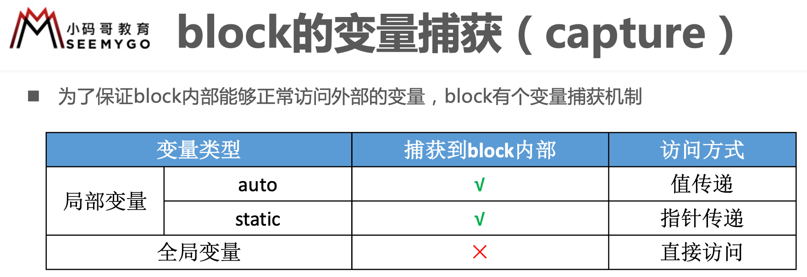


auto 自动变量

``` c++
struct __main_block_impl_0 {
  struct __block_impl impl;
  struct __main_block_desc_0* Desc;
  int age; // 值传递
  __main_block_impl_0(void *fp, struct __main_block_desc_0 *desc, int _age, int flags=0) : age(_age) {
    impl.isa = &_NSConcreteStackBlock;
    impl.Flags = flags;
    impl.FuncPtr = fp;
    Desc = desc;
  }
};
```


static变量

``` c++
static int age = 20;

void (^block)(int, int) =  ^(int a , int b){
    NSLog(@"this is a block! -- %d", age);
};

struct __main_block_impl_0 {
  struct __block_impl impl;
  struct __main_block_desc_0* Desc;
  int *age; // 指针传递
  __main_block_impl_0(void *fp, struct __main_block_desc_0 *desc, int *_age, int flags=0) : age(_age) {
    impl.isa = &_NSConcreteStackBlock;
    impl.Flags = flags;
    impl.FuncPtr = fp;
    Desc = desc;
  }
};
```


##### block中使用self，会不会捕获到block中？

会捕获。实例方法中为什么可以使用self，是因为self是一个隐式参数（还有SEL _cmd），指向方法的调用者，既然是一个参数，那么也是一个局部变量，所以会捕获。

##### block中使用成员变量，会不会捕获？

会捕获，而且捕获的是self，并不是这个成员变量，block中使用成员变量其实是使用的 self->成员变量。


## 8.2 block的类型

- block有3种类型，可以通过调用class方法或者isa指针查看具体类型，最终都是继承自NSBlock类型
    - \__NSGlobalBlock__ （ _NSConcreteGlobalBlock ）
	- \__NSStackBlock__ （ _NSConcreteStackBlock ）
	- \__NSMallocBlock__ （ _NSConcreteMallocBlock ）

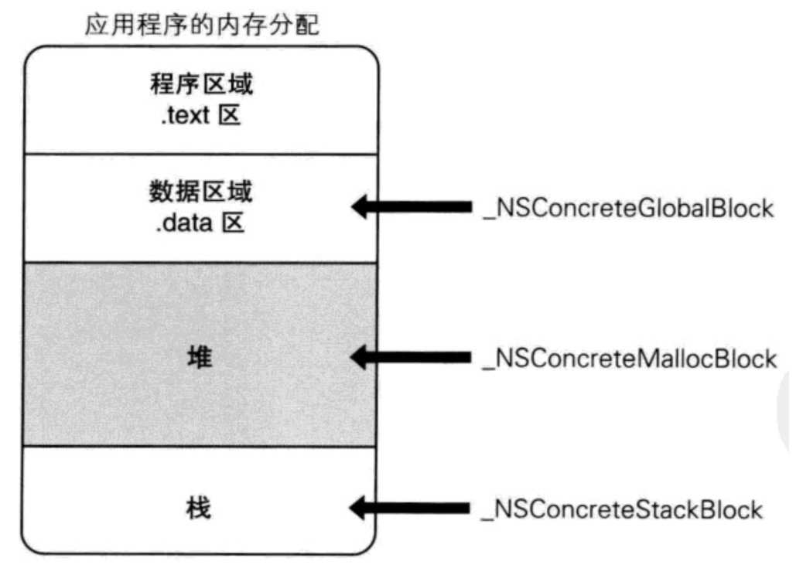

| block类型         | **环境**                   |
| ----------------- | -------------------------- |
| __NSGlobalBlock__ | 没有访问auto变量           |
| __NSStackBlock__  | 访问了auto变量             |
| __NSMallocBlock__ | __NSStackBlock__调用了copy |


每一种类型的block调用copy后的结果如下所示

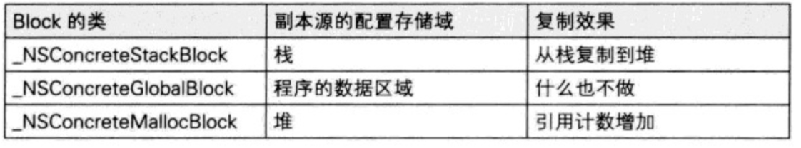

##### 定义block属性的时候使用什么操作符？

因为访问了auto变量的block是存放在栈中的，在访问这个block的时候有可能已经销毁，所以要调用copy方法，把block放到堆中，所以定义的时候使用copy操作符。

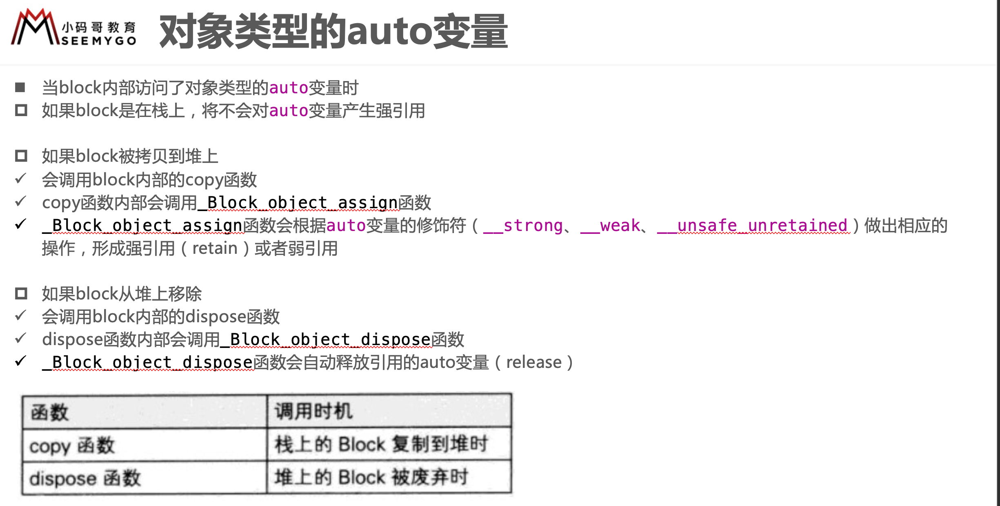


## 8.4 block在修改NSMutableArray，需不需要添加__block?
- 如修改NSMutableArray的存储内容的话,是不需要添加__block修饰的。
- 如修改NSMutableArray对象的本身,那必须添加__block修饰。

## __block 修饰符

__block的作用是什么？有什么使用注意点

__block可以用于解决block内部无法修改auto变量值的问题

__block不能修饰全局变量、静态变量（static）

编译器会将__block变量包装成一个对象

``` c++

struct __main_block_impl_0 {
  struct __block_impl impl;
  struct __main_block_desc_0* Desc;
  __Block_byref_age_0 *age; // by ref
  __main_block_impl_0(void *fp, struct __main_block_desc_0 *desc, __Block_byref_age_0 *_age, int flags=0) : age(_age->__forwarding) {
    impl.isa = &_NSConcreteStackBlock;
    impl.Flags = flags;
    impl.FuncPtr = fp;
    Desc = desc;
  }
};

struct __Block_byref_age_0 {
  void *__isa;
__Block_byref_age_0 *__forwarding;
 int __flags;
 int __size;
 int age;
};
```


## 循环引用

``` objc
// 解决循环引用
__weak typeof(self) weakSelf = self;
```


# 9. 属性修饰

- assign
    - 修饰基本数据类型
    - 修饰对象类型时，不增加其引用计数，会产生悬垂指针
- weak
    - 只能修饰对象类型
    - 修饰弱引用，不增加对象引用计数，主要可以用于避免循环引用
    - weak 修饰的对象在被释放之后，会自动将指针置为 nil，不会产生悬垂指针
- strong
    - 修饰强引用，将指针原来指向的旧对象释放掉，然后指向新对象，同时将新对象的引用计数加1；
    - 但是在修饰 block 时，strong 相当于 copy，而 retain 相当于 assign
- copy
    - setter 方法的实现是 release 旧值，copy 新值，用于 NSString、block 等类型。


## copy

copy：产生不可变副本
mutableCopy：产生可变副本

``` objc
@property (copy, nonatomic) NSMutableArray *data;
data = [NSMutableArray array];
[p.data addObject:@"jack"]; // 崩溃：因为property的修饰符为copy，所以第二句代码的赋值操作后，data就变为了不可变数组
```


# 10. Weak的底层实现原理

Runtime会维护一个weak表，用于维护指向对象的所有weak指针。weak表是一个哈希表，其key为所指对象的指针，value为weak指针的地址数组。
 具体过程如下：

1、初始化时：runtime会调用objc_initWeak函数，初始化一个新的weak指针指向对象的地址。
 2、添加引用时：objc_initWeak函数会调用 objc_storeWeak() 函数，更新指针指向，创建对应的弱引用表。
 3、释放时，调用clearDeallocating函数。clearDeallocating函数首先根据对象地址获取所有weak指针地址的数组，然后遍历这个数组把其中的数据设为nil，最后把这个entry从weak表中删除，最后清理对象的记录。


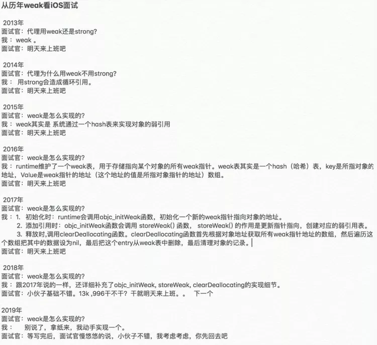
