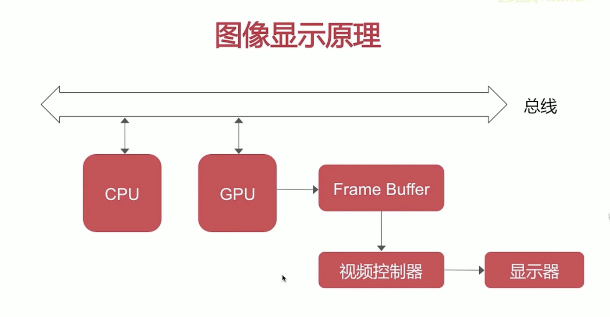
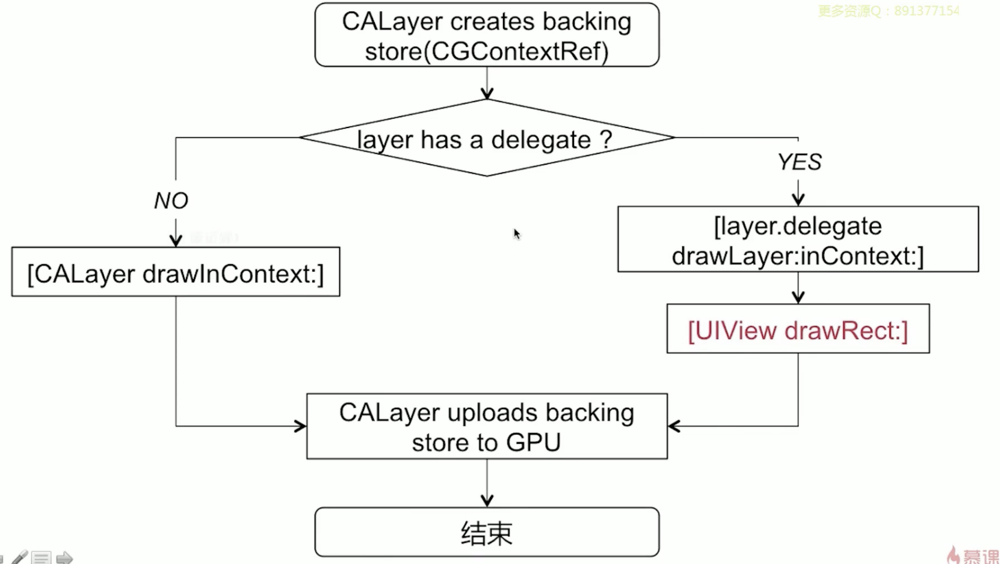

# UITableView 重用机制

当Cell要显示的时候，会判断重用池中有没有可用Cell，如果有福永重用池中的Cell，如果没有，新创建。当Cell显示消失的时候，会被加入到重用池中。

# 数据源同步问题

# UIView 和 CALayer

# 事件传递与视图响应链

# 图像显示原理

- CPU部分

    - Layout
        - UI布局
        - 文本计算
    - Display
        - 绘制
    - Prepare
        - 图片编解码
    - Commit
        - 提交位图

- GPU部分

    

# UI卡顿/掉帧的原因

### 滑动优化方案

- CPU
    - 对象创建/调整/销毁，放到子线程
    - 预排版（布局计算/文本计算）
    - 预渲染（文本等异步绘制/图片编解码等）
- GPU
    - 纹理渲染
    - 视图混合

# 异步绘制

# 离屏渲染

