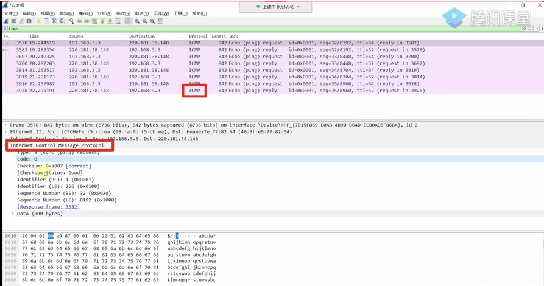

### 显示过滤


# iOS Sorket抓包

```shell
添加设备终端命令：
rvictl -s 28c9cf7cdec854be3d4a3a7b789bfd6a67b189f1

报错：Starting device 28c9cf7cdec854be3d4a3a7b789bfd6a67b189f1 [FAILED]
解决办法：
as root:

installer -pkg /Applications/Xcode.app/Contents/Resources/Packages/MobileDeviceDevelopment.pkg -target /

After that in uppercase:

rvictl -s UUID (it will open to you change the preferences of your systems and reboot)

After restart, everything fine over here.

Hope that help you folks


查看添加设备的列表命令： 
rvictl -l
移除设备命令： 
rvictl -x 28c9cf7cdec854be3d4a3a7b789bfd6a67b189f1

```



