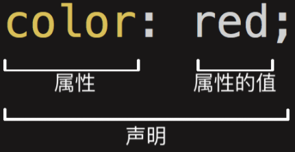
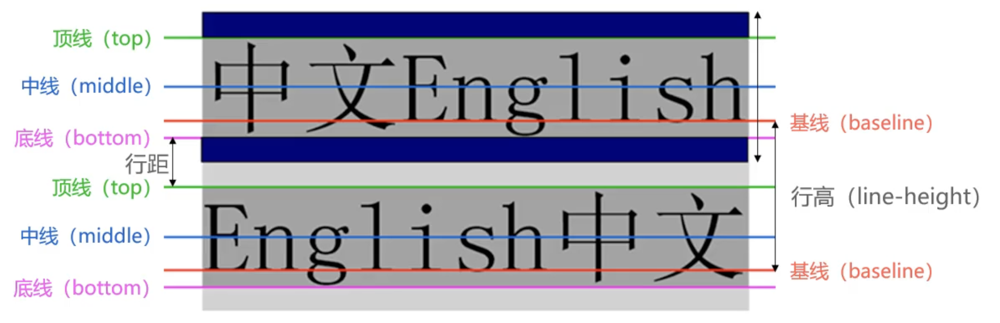

- CSS：Cascading Style Sheet 又称为串样式列表、级联样式表、串接样式表，为网页添加样式的代码。
- 是一种计算机语言，但不是编程语言


### CSS如何编写




### 如何将CSS样式应用到元素上？


#### 内联样式（inline style）

HTML元素的style属性中编写样式

 ``` html
 <div style="color: red; font-size: 29px;">内联样式</div>
 ```


#### 内部样式表（internal style sheet）

将CSS放在HTML文件<head>元素里的<style>元素之中

``` html
<head>
    <style>
        div {
            color: red;
            font-size: 18px;
        }
    </style>
</head>
```


#### 外部样式表（external style sheet）

将CSS编写在一个独立的文件中，并通过<link>元素引入进来

``` css
.title {
    background-color: yellow;
}
```

``` html
<!DOCTYPE html>
<html lang="en">
<head>
    <!-- link元素用来引入资源 -->
    <!-- stylesheet 样式资源 -->
    <link rel="stylesheet" href="./CSS/style.css">
</head>
<body>
    <div class="title">外部样式</div>
</body>
</html> 
```


可以建一个index.css文件统一管理css

``` css
@import url(./style1.css);
@import url(./style2.css);
@import url(./style3.css);
```


### 文档

- CSS官方文档地址
    - https://www.w3.org/TR/?tag=css

- CSS推荐文档地址
    - https://developer.mozilla.org/zh-CN/docs/Web/CSS/Reference#%E5%85%B3%E9%94%AE%E5%AD%97%E7%B4%A2%E5%BC%95

- 由于浏览器版本、CSS版本等问题，查询某些CSS是否可用

    - 可以到https://caniuse.com/查询CSS属性的可用性

    - 这个网站在后续的browserlist工具中我们再详细说明


### 颜色

``` css
rgb(255, 0, 0)
rgba(255, 0, 0, 255)
#ff0099
#f09

```


 

# 文本


## text-decoration

decoration 装饰

- none： 无装饰线，可以去掉a元素默认的下划线
- underline： 下划线
- overline：上划线
- line-through：中划线（删除线）


## text-transform（了解）

- capitalize：首字母大写
- uppercase：所有字符大些
- lowercase：所有字符小写
- none：没有影响


## text-indent（了解）

首行缩进

``` css
/* em: 相对于字体的大小 */
text-indent: 2em;
```


## text-align

行内内容（不只是text）如何相对它的块父元素对齐

仅行内级元素，div是块级元素，此属性无效。解决此问题，可以设置 div 的 display 为 inline-block，或设置 margin 为 0 auto。

- left
- right
- center
- justify：两端对齐


# 字体

``` css
font-weight: bold;
font-weight: 700

font-style: italic /* 斜体 */
font-style: oblique /* 倾斜 */

/* 缩写属性 */
font: italic small-caps 700 30px/30px small;
```


line-height：两行文本基线（baseline）之间的间距

基线（baseline）：与小写字母x最底部对齐的线




# 选择器

## 通用选择器

``` css
/* 会遍历所有HTML元素，不推介使用 */
* {
    font-size: 20px;
}

/* 更推荐的做法 */
body, p, div, span {
	margin: 0;
    padding: 0;
}
```

## 简单选择器

### 元素选择器

元素的名称

### 类选择器

.类名

### id选择器

#id

## 属性选择器

``` css
[title] {

}

[title=div] {

}
```

## 后代选择器

``` css
.home span {

}

/* 直接子代选择器 */
.classSelector > span {

}

/* 相邻兄弟选择器 */
.classSelector + span {

}


/* 普遍兄弟选择器 */
.classSelector ～ span {

}

/* <div class="box"></div> */
div.box {

}
```


## 伪类

Pseudo-classes

也是一种选择器，用于选择处于特定状态的元素

``` css
/* hover: 鼠标悬浮于元素的状态 */
div:hover {

}
```

- :link 未访问的链接
- :visited 已访问的链接
- :active 鼠标在链接上长按未松开
- :focus 拥有输入焦点

注意：

- hover必须放在link和visited后面才能生效
- active必须放在hover上面才能生效


## 伪元素


